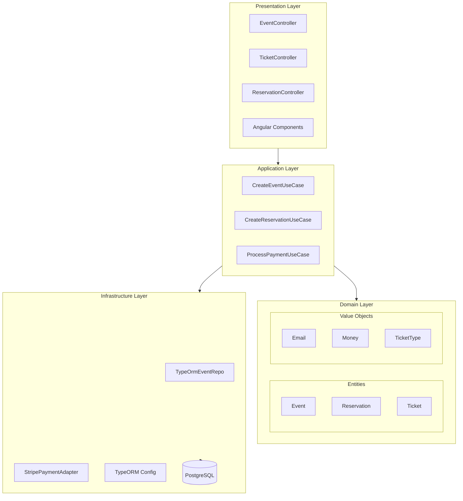
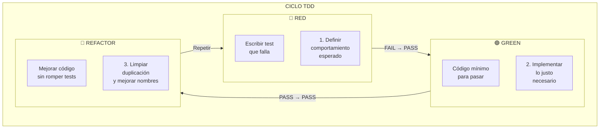
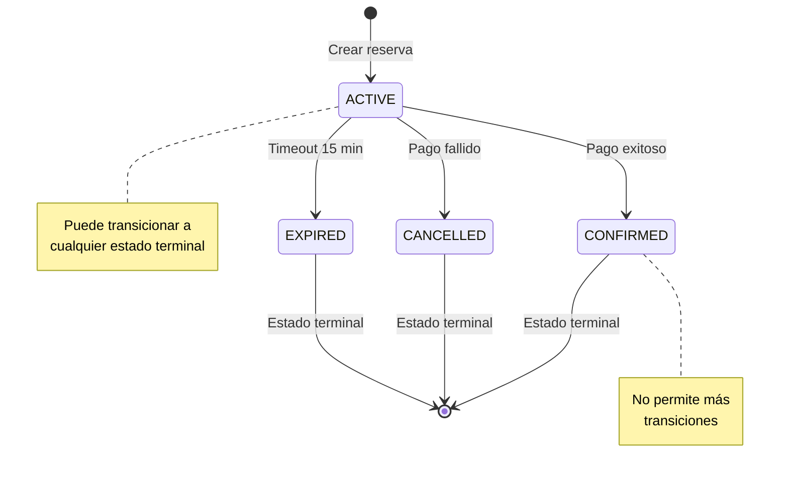

# Design Document: Ticket Sales System

## Overview

Sistema de venta de entradas desarrollado con **Clean Architecture**, aplicando principios **SOLID**, patrones de diseño **GoF** y metodología **TDD**. 

### Stack Tecnológico

| Componente | Tecnología | Versión |
|------------|------------|---------|
| Backend Framework | NestJS | 10.x |
| Lenguaje | TypeScript | 5.x (strict mode) |
| ORM | TypeORM | 0.3.x |
| Base de Datos | PostgreSQL | 15.x |
| Testing | Jest + fast-check | Latest |
| Validación | class-validator + class-transformer | Latest |
| Contenedores | Docker + Docker Compose | Latest |

### Configuración Docker

```yaml
# docker-compose.yml
version: '3.8'

services:
  postgres:
    image: postgres:15-alpine
    container_name: ticket-db
    environment:
      POSTGRES_USER: ticket_user
      POSTGRES_PASSWORD: ticket_pass
      POSTGRES_DB: ticket_sales
    ports:
      - "5432:5432"
    volumes:
      - postgres_data:/var/lib/postgresql/data
    networks:
      - ticket-network
    healthcheck:
      test: ["CMD-SHELL", "pg_isready -U ticket_user -d ticket_sales"]
      interval: 10s
      timeout: 5s
      retries: 5

  backend:
    build:
      context: ./backend
      dockerfile: Dockerfile
      target: development
    container_name: ticket-backend
    environment:
      NODE_ENV: development
      DATABASE_HOST: postgres
      DATABASE_PORT: 5432
      DATABASE_USER: ticket_user
      DATABASE_PASSWORD: ticket_pass
      DATABASE_NAME: ticket_sales
    ports:
      - "3000:3000"
    volumes:
      - ./backend:/app
      - /app/node_modules
    depends_on:
      postgres:
        condition: service_healthy
    networks:
      - ticket-network
    command: npm run start:dev

  frontend:
    build:
      context: ./frontend
      dockerfile: Dockerfile
      target: development
    container_name: ticket-frontend
    ports:
      - "4200:4200"
    volumes:
      - ./frontend:/app
      - /app/node_modules
    depends_on:
      - backend
    networks:
      - ticket-network
    command: npm run start

  test-db:
    image: postgres:15-alpine
    container_name: ticket-test-db
    environment:
      POSTGRES_USER: test_user
      POSTGRES_PASSWORD: test_pass
      POSTGRES_DB: ticket_sales_test
    ports:
      - "5433:5432"
    networks:
      - ticket-network
    profiles:
      - test

networks:
  ticket-network:
    driver: bridge

volumes:
  postgres_data:
```

### Dockerfile Backend (Multi-stage)

```dockerfile
# backend/Dockerfile
FROM node:20-alpine AS base
WORKDIR /app
RUN apk add --no-cache libc6-compat

# Development stage
FROM base AS development
COPY package*.json ./
RUN npm ci
COPY . .
EXPOSE 3000
CMD ["npm", "run", "start:dev"]

# Build stage
FROM base AS builder
COPY package*.json ./
RUN npm ci
COPY . .
RUN npm run build

# Production stage
FROM base AS production
ENV NODE_ENV=production
COPY package*.json ./
RUN npm ci --only=production && npm cache clean --force
COPY --from=builder /app/dist ./dist
EXPOSE 3000
USER node
CMD ["node", "dist/main.js"]
```

### Dockerfile Frontend (Multi-stage)

```dockerfile
# frontend/Dockerfile
FROM node:20-alpine AS base
WORKDIR /app
RUN apk add --no-cache libc6-compat

# Development stage
FROM base AS development
COPY package*.json ./
RUN npm ci
COPY . .
EXPOSE 4200
CMD ["npm", "run", "start", "--", "--host", "0.0.0.0"]

# Build stage
FROM base AS builder
COPY package*.json ./
RUN npm ci
COPY . .
RUN npm run build

# Production stage
FROM nginx:alpine AS production
COPY --from=builder /app/dist/frontend/browser /usr/share/nginx/html
COPY nginx.conf /etc/nginx/nginx.conf
EXPOSE 80
CMD ["nginx", "-g", "daemon off;"]
```

### Configuración TypeScript Estricta

```json
{
  "compilerOptions": {
    "strict": true,
    "noImplicitAny": true,
    "strictNullChecks": true,
    "strictFunctionTypes": true,
    "strictBindCallApply": true,
    "strictPropertyInitialization": true,
    "noImplicitThis": true,
    "alwaysStrict": true,
    "noUncheckedIndexedAccess": true,
    "exactOptionalPropertyTypes": true
  }
}
```

## Architecture

### Clean Architecture Layers



### Estructura de Directorios (Backend NestJS)

```
src/
├── domain/                          # Capa de Dominio (sin dependencias externas)
│   ├── entities/
│   │   ├── event.entity.ts
│   │   ├── ticket.entity.ts
│   │   └── reservation.entity.ts
│   ├── value-objects/
│   │   ├── email.vo.ts
│   │   ├── money.vo.ts
│   │   ├── ticket-type.vo.ts
│   │   └── ticket-quantity.vo.ts
│   ├── states/                      # State Pattern
│   │   ├── reservation-state.interface.ts
│   │   ├── active-reservation.state.ts
│   │   ├── confirmed-reservation.state.ts
│   │   ├── expired-reservation.state.ts
│   │   └── cancelled-reservation.state.ts
│   ├── strategies/                  # Strategy Pattern
│   │   ├── pricing-strategy.interface.ts
│   │   ├── vip-pricing.strategy.ts
│   │   ├── general-pricing.strategy.ts
│   │   └── early-bird-pricing.strategy.ts
│   ├── events/                      # Domain Events
│   │   ├── payment-completed.event.ts
│   │   ├── payment-failed.event.ts
│   │   └── ticket-released.event.ts
│   ├── exceptions/
│   │   ├── domain.exception.ts
│   │   ├── event-not-found.exception.ts
│   │   ├── insufficient-tickets.exception.ts
│   │   └── invalid-state-transition.exception.ts
│   └── interfaces/                  # Repository Interfaces (DIP)
│       ├── event-repository.interface.ts
│       ├── ticket-repository.interface.ts
│       └── reservation-repository.interface.ts
├── application/                     # Capa de Aplicación
│   ├── use-cases/
│   │   ├── create-event.use-case.ts
│   │   ├── create-reservation.use-case.ts
│   │   ├── process-payment.use-case.ts
│   │   ├── release-tickets.use-case.ts
│   │   └── get-buyer-tickets.use-case.ts
│   ├── dto/
│   │   ├── create-event.dto.ts
│   │   ├── create-reservation.dto.ts
│   │   ├── process-payment.dto.ts
│   │   └── ticket-response.dto.ts
│   ├── mappers/
│   │   ├── event.mapper.ts
│   │   ├── ticket.mapper.ts
│   │   └── reservation.mapper.ts
│   └── services/
│       ├── ticket-availability.service.ts
│       └── pricing.service.ts
├── infrastructure/                  # Capa de Infraestructura
│   ├── persistence/
│   │   ├── entities/               # TypeORM Entities (separadas del dominio)
│   │   │   ├── event.orm-entity.ts
│   │   │   ├── ticket.orm-entity.ts
│   │   │   └── reservation.orm-entity.ts
│   │   ├── repositories/
│   │   │   ├── typeorm-event.repository.ts
│   │   │   ├── typeorm-ticket.repository.ts
│   │   │   └── typeorm-reservation.repository.ts
│   │   └── typeorm.config.ts
│   ├── external/
│   │   ├── payment-gateway.interface.ts
│   │   └── stripe-payment.adapter.ts
│   └── common/
│       ├── retry-policy.ts
│       └── domain-exception.filter.ts
├── presentation/                    # Capa de Presentación
│   └── controllers/
│       ├── event.controller.ts
│       ├── ticket.controller.ts
│       └── reservation.controller.ts
└── modules/                         # NestJS Modules
    ├── event.module.ts
    ├── ticket.module.ts
    ├── reservation.module.ts
    └── payment.module.ts
```


## Components and Interfaces

### Principio ISP: Interfaces Segregadas

```typescript
// ❌ MAL: Interface masiva (viola ISP)
interface ITicketService {
  createTicket(): Ticket;
  getTicket(): Ticket;
  updateTicket(): Ticket;
  deleteTicket(): void;
  reserveTicket(): Reservation;
  releaseTicket(): void;
  calculatePrice(): Money;
  validateTicket(): boolean;
}

// ✅ BIEN: Interfaces segregadas (cumple ISP)
interface ITicketCreator {
  create(data: CreateTicketData): Ticket;
}

interface ITicketReader {
  findById(id: string): Promise<Ticket | null>;
  findByBuyer(email: Email): Promise<Ticket[]>;
}

interface ITicketPriceCalculator {
  calculatePrice(type: TicketType, quantity: number): Money;
}
```

### Patrón State - Ciclo de Vida de Reserva (OCP + LSP)

```typescript
// Interface del estado (ISP)
interface IReservationState {
  readonly name: ReservationStatusType;
  canConfirm(): boolean;
  canCancel(): boolean;
  canExpire(): boolean;
  confirm(reservation: Reservation): void;
  cancel(reservation: Reservation): void;
  expire(reservation: Reservation): void;
}

// Type literal para estados válidos
type ReservationStatusType = 'ACTIVE' | 'CONFIRMED' | 'EXPIRED' | 'CANCELLED';

// Estado concreto: Active (LSP - sustituible por IReservationState)
class ActiveReservationState implements IReservationState {
  readonly name: ReservationStatusType = 'ACTIVE';

  canConfirm(): boolean {
    return true;
  }

  canCancel(): boolean {
    return true;
  }

  canExpire(): boolean {
    return true;
  }

  confirm(reservation: Reservation): void {
    reservation.setState(new ConfirmedReservationState());
  }

  cancel(reservation: Reservation): void {
    reservation.setState(new CancelledReservationState());
  }

  expire(reservation: Reservation): void {
    reservation.setState(new ExpiredReservationState());
  }
}

// Estado concreto: Confirmed (estado terminal)
class ConfirmedReservationState implements IReservationState {
  readonly name: ReservationStatusType = 'CONFIRMED';

  canConfirm(): boolean {
    return false;
  }

  canCancel(): boolean {
    return false;
  }

  canExpire(): boolean {
    return false;
  }

  confirm(_reservation: Reservation): void {
    throw new InvalidStateTransitionException('CONFIRMED', 'confirm');
  }

  cancel(_reservation: Reservation): void {
    throw new InvalidStateTransitionException('CONFIRMED', 'cancel');
  }

  expire(_reservation: Reservation): void {
    throw new InvalidStateTransitionException('CONFIRMED', 'expire');
  }
}

// Estados adicionales: Expired y Cancelled siguen el mismo patrón
```

### Patrón Strategy - Cálculo de Precios (OCP)

```typescript
// Interface de estrategia (ISP)
interface IPricingStrategy {
  readonly ticketType: TicketType;
  calculatePrice(basePrice: Money, quantity: number): Money;
}

// Estrategia VIP: +50% sobre precio base
class VipPricingStrategy implements IPricingStrategy {
  readonly ticketType = TicketType.VIP;
  private readonly PREMIUM_MULTIPLIER = 1.5;

  calculatePrice(basePrice: Money, quantity: number): Money {
    return basePrice.multiply(quantity).multiply(this.PREMIUM_MULTIPLIER);
  }
}

// Estrategia General: precio base sin modificación
class GeneralPricingStrategy implements IPricingStrategy {
  readonly ticketType = TicketType.GENERAL;

  calculatePrice(basePrice: Money, quantity: number): Money {
    return basePrice.multiply(quantity);
  }
}

// Estrategia Early Bird: -20% descuento
class EarlyBirdPricingStrategy implements IPricingStrategy {
  readonly ticketType = TicketType.EARLY_BIRD;
  private readonly DISCOUNT_MULTIPLIER = 0.8;

  calculatePrice(basePrice: Money, quantity: number): Money {
    return basePrice.multiply(quantity).multiply(this.DISCOUNT_MULTIPLIER);
  }
}

// Servicio que usa las estrategias (OCP - abierto a extensión, cerrado a modificación)
@Injectable()
class PricingService {
  private readonly strategies: Map<TicketType, IPricingStrategy>;

  constructor() {
    this.strategies = new Map([
      [TicketType.VIP, new VipPricingStrategy()],
      [TicketType.GENERAL, new GeneralPricingStrategy()],
      [TicketType.EARLY_BIRD, new EarlyBirdPricingStrategy()],
    ]);
  }

  calculatePrice(ticketType: TicketType, basePrice: Money, quantity: number): Money {
    const strategy = this.strategies.get(ticketType);
    if (!strategy) {
      throw new Error(`No pricing strategy found for ticket type: ${ticketType}`);
    }
    return strategy.calculatePrice(basePrice, quantity);
  }
}
```

### Patrón Factory - Creación de Tickets (SRP)

```typescript
// Interface de factory (ISP)
interface ITicketFactory {
  create(data: CreateTicketData): Ticket;
}

// Datos necesarios para crear un ticket
interface CreateTicketData {
  readonly eventId: string;
  readonly ticketType: TicketType;
  readonly buyerEmail: Email;
  readonly price: Money;
}

// Factory concreta (SRP - solo responsable de crear tickets)
@Injectable()
class TicketFactory implements ITicketFactory {
  create(data: CreateTicketData): Ticket {
    const id = this.generateId();
    const code = this.generateUniqueCode();
    const purchaseDate = new Date();

    return new Ticket(
      id,
      code,
      data.eventId,
      data.ticketType,
      data.buyerEmail,
      data.price,
      purchaseDate
    );
  }

  private generateId(): string {
    return crypto.randomUUID();
  }

  private generateUniqueCode(): string {
    const timestamp = Date.now().toString(36);
    const random = Math.random().toString(36).substring(2, 8);
    return `TKT-${timestamp}-${random}`.toUpperCase();
  }
}
```

### Patrón Repository - Abstracción de Persistencia (DIP)

```typescript
// Interfaces de repositorio en capa de dominio (DIP)
interface IEventRepository {
  save(event: Event): Promise<Event>;
  findById(id: string): Promise<Event | null>;
  findAll(): Promise<Event[]>;
  update(event: Event): Promise<Event>;
}

interface ITicketRepository {
  save(ticket: Ticket): Promise<Ticket>;
  saveMany(tickets: Ticket[]): Promise<Ticket[]>;
  findByBuyer(email: Email): Promise<Ticket[]>;
  findByEvent(eventId: string): Promise<Ticket[]>;
}

interface IReservationRepository {
  save(reservation: Reservation): Promise<Reservation>;
  findById(id: string): Promise<Reservation | null>;
  findExpired(): Promise<Reservation[]>;
  findActiveByEvent(eventId: string): Promise<Reservation[]>;
  update(reservation: Reservation): Promise<Reservation>;
}

// Tokens de inyección para NestJS
const EVENT_REPOSITORY = Symbol('IEventRepository');
const TICKET_REPOSITORY = Symbol('ITicketRepository');
const RESERVATION_REPOSITORY = Symbol('IReservationRepository');
```

### Patrón Observer - Eventos de Dominio

```typescript
// Eventos de dominio tipados
class PaymentCompletedEvent {
  constructor(
    public readonly reservationId: string,
    public readonly amount: Money,
    public readonly timestamp: Date
  ) {}
}

class PaymentFailedEvent {
  constructor(
    public readonly reservationId: string,
    public readonly reason: string,
    public readonly timestamp: Date
  ) {}
}

class TicketReleasedEvent {
  constructor(
    public readonly eventId: string,
    public readonly ticketType: TicketType,
    public readonly quantity: number,
    public readonly reason: string,
    public readonly timestamp: Date
  ) {}
}

// Handler usando EventEmitter2 de NestJS
@Injectable()
class PaymentFailedHandler {
  constructor(
    @Inject(RESERVATION_REPOSITORY)
    private readonly reservationRepository: IReservationRepository,
    private readonly releaseTicketsUseCase: ReleaseTicketsUseCase
  ) {}

  @OnEvent('payment.failed')
  async handle(event: PaymentFailedEvent): Promise<void> {
    await this.releaseTicketsUseCase.execute(event.reservationId, event.reason);
  }
}
```

### Patrón Adapter - Gateway de Pagos (DIP)

```typescript
// Interface del gateway (en dominio)
interface IPaymentGateway {
  processPayment(data: PaymentData): Promise<PaymentResult>;
}

interface PaymentData {
  readonly amount: Money;
  readonly currency: string;
  readonly description: string;
  readonly metadata: Record<string, string>;
}

// Discriminated union para resultado
type PaymentResult =
  | { success: true; transactionId: string; processedAt: Date }
  | { success: false; errorCode: string; errorMessage: string };

// Adapter concreto para Stripe (en infraestructura)
@Injectable()
class StripePaymentAdapter implements IPaymentGateway {
  constructor(private readonly stripeClient: Stripe) {}

  async processPayment(data: PaymentData): Promise<PaymentResult> {
    try {
      const paymentIntent = await this.stripeClient.paymentIntents.create({
        amount: Math.round(data.amount.amount * 100), // Stripe usa centavos
        currency: data.currency.toLowerCase(),
        description: data.description,
        metadata: data.metadata,
      });

      return {
        success: true,
        transactionId: paymentIntent.id,
        processedAt: new Date(),
      };
    } catch (error) {
      return {
        success: false,
        errorCode: error.code ?? 'UNKNOWN_ERROR',
        errorMessage: error.message ?? 'Payment processing failed',
      };
    }
  }
}
```

## Data Models

### Value Objects (Inmutables con Validación)

```typescript
// TicketType como enum tipado
enum TicketType {
  VIP = 'VIP',
  GENERAL = 'GENERAL',
  EARLY_BIRD = 'EARLY_BIRD',
}

// Money Value Object (Inmutable)
class Money {
  private constructor(
    public readonly amount: number,
    public readonly currency: string
  ) {}

  static create(amount: number, currency: string = 'USD'): Money {
    if (amount < 0) {
      throw new InvalidMoneyException('Amount cannot be negative');
    }
    if (!currency || currency.length !== 3) {
      throw new InvalidMoneyException('Currency must be a 3-letter code');
    }
    return new Money(amount, currency.toUpperCase());
  }

  add(other: Money): Money {
    this.validateSameCurrency(other);
    return Money.create(this.amount + other.amount, this.currency);
  }

  multiply(factor: number): Money {
    return Money.create(this.amount * factor, this.currency);
  }

  equals(other: Money): boolean {
    return this.amount === other.amount && this.currency === other.currency;
  }

  private validateSameCurrency(other: Money): void {
    if (this.currency !== other.currency) {
      throw new InvalidMoneyException(
        `Cannot operate on different currencies: ${this.currency} vs ${other.currency}`
      );
    }
  }
}

// Email Value Object
class Email {
  private static readonly EMAIL_REGEX = /^[^\s@]+@[^\s@]+\.[^\s@]+$/;

  private constructor(public readonly value: string) {}

  static create(value: string): Email {
    const trimmed = value.trim().toLowerCase();
    if (!Email.EMAIL_REGEX.test(trimmed)) {
      throw new InvalidEmailException(`Invalid email format: ${value}`);
    }
    return new Email(trimmed);
  }

  equals(other: Email): boolean {
    return this.value === other.value;
  }
}

// TicketQuantity Value Object
class TicketQuantity {
  private static readonly MIN_QUANTITY = 1;
  private static readonly MAX_QUANTITY = 10;

  private constructor(public readonly value: number) {}

  static create(value: number): TicketQuantity {
    if (!Number.isInteger(value)) {
      throw new InvalidQuantityException('Quantity must be an integer');
    }
    if (value < TicketQuantity.MIN_QUANTITY || value > TicketQuantity.MAX_QUANTITY) {
      throw new InvalidQuantityException(
        `Quantity must be between ${TicketQuantity.MIN_QUANTITY} and ${TicketQuantity.MAX_QUANTITY}`
      );
    }
    return new TicketQuantity(value);
  }
}
```

### Entidades de Dominio

```typescript
// Event Entity
class Event {
  constructor(
    public readonly id: string,
    public readonly name: string,
    public readonly date: Date,
    public readonly location: string,
    private _ticketConfigurations: TicketConfiguration[]
  ) {}

  get ticketConfigurations(): ReadonlyArray<TicketConfiguration> {
    return [...this._ticketConfigurations];
  }

  getAvailability(ticketType: TicketType): number {
    const config = this._ticketConfigurations.find(c => c.type === ticketType);
    return config?.availableQuantity ?? 0;
  }

  reserveTickets(ticketType: TicketType, quantity: number): void {
    const config = this._ticketConfigurations.find(c => c.type === ticketType);
    if (!config) {
      throw new TicketTypeNotFoundException(ticketType);
    }
    if (config.availableQuantity < quantity) {
      throw new InsufficientTicketsException(ticketType, quantity, config.availableQuantity);
    }
    config.decrementAvailability(quantity);
  }

  releaseTickets(ticketType: TicketType, quantity: number): void {
    const config = this._ticketConfigurations.find(c => c.type === ticketType);
    if (config) {
      config.incrementAvailability(quantity);
    }
  }
}

// TicketConfiguration (parte de Event)
class TicketConfiguration {
  constructor(
    public readonly type: TicketType,
    public readonly price: Money,
    public readonly totalQuantity: number,
    private _availableQuantity: number
  ) {}

  get availableQuantity(): number {
    return this._availableQuantity;
  }

  decrementAvailability(quantity: number): void {
    if (this._availableQuantity < quantity) {
      throw new InsufficientTicketsException(this.type, quantity, this._availableQuantity);
    }
    this._availableQuantity -= quantity;
  }

  incrementAvailability(quantity: number): void {
    const newAvailable = this._availableQuantity + quantity;
    if (newAvailable > this.totalQuantity) {
      this._availableQuantity = this.totalQuantity;
    } else {
      this._availableQuantity = newAvailable;
    }
  }
}

// Reservation Entity con State Pattern
class Reservation {
  private _state: IReservationState;

  constructor(
    public readonly id: string,
    public readonly eventId: string,
    public readonly ticketType: TicketType,
    public readonly quantity: TicketQuantity,
    public readonly buyerEmail: Email,
    public readonly totalAmount: Money,
    public readonly expiresAt: Date,
    public readonly createdAt: Date
  ) {
    this._state = new ActiveReservationState();
  }

  get status(): ReservationStatusType {
    return this._state.name;
  }

  get isActive(): boolean {
    return this._state.name === 'ACTIVE';
  }

  get isExpired(): boolean {
    return new Date() > this.expiresAt && this._state.name === 'ACTIVE';
  }

  setState(state: IReservationState): void {
    this._state = state;
  }

  confirm(): void {
    if (!this._state.canConfirm()) {
      throw new InvalidStateTransitionException(this._state.name, 'confirm');
    }
    this._state.confirm(this);
  }

  cancel(): void {
    if (!this._state.canCancel()) {
      throw new InvalidStateTransitionException(this._state.name, 'cancel');
    }
    this._state.cancel(this);
  }

  expire(): void {
    if (!this._state.canExpire()) {
      throw new InvalidStateTransitionException(this._state.name, 'expire');
    }
    this._state.expire(this);
  }
}

// Ticket Entity
class Ticket {
  constructor(
    public readonly id: string,
    public readonly code: string,
    public readonly eventId: string,
    public readonly type: TicketType,
    public readonly buyerEmail: Email,
    public readonly price: Money,
    public readonly purchaseDate: Date
  ) {}

  toJSON(): TicketJSON {
    return {
      id: this.id,
      code: this.code,
      eventId: this.eventId,
      type: this.type,
      buyerEmail: this.buyerEmail.value,
      price: { amount: this.price.amount, currency: this.price.currency },
      purchaseDate: this.purchaseDate.toISOString(),
    };
  }
}

interface TicketJSON {
  id: string;
  code: string;
  eventId: string;
  type: TicketType;
  buyerEmail: string;
  price: { amount: number; currency: string };
  purchaseDate: string;
}
```

### TypeORM Entities (Infraestructura - Separadas del Dominio)

```typescript
// Event ORM Entity
@Entity('events')
class EventOrmEntity {
  @PrimaryColumn('uuid')
  id: string;

  @Column({ length: 255 })
  name: string;

  @Column('timestamp')
  date: Date;

  @Column({ length: 500 })
  location: string;

  @OneToMany(() => TicketConfigurationOrmEntity, config => config.event, {
    cascade: true,
    eager: true,
  })
  ticketConfigurations: TicketConfigurationOrmEntity[];

  @CreateDateColumn()
  createdAt: Date;

  @UpdateDateColumn()
  updatedAt: Date;
}

// TicketConfiguration ORM Entity
@Entity('ticket_configurations')
class TicketConfigurationOrmEntity {
  @PrimaryGeneratedColumn('uuid')
  id: string;

  @ManyToOne(() => EventOrmEntity, event => event.ticketConfigurations)
  @JoinColumn({ name: 'event_id' })
  event: EventOrmEntity;

  @Column({ type: 'enum', enum: TicketType })
  type: TicketType;

  @Column('decimal', { precision: 10, scale: 2 })
  price: number;

  @Column()
  totalQuantity: number;

  @Column()
  availableQuantity: number;
}

// Reservation ORM Entity
@Entity('reservations')
class ReservationOrmEntity {
  @PrimaryColumn('uuid')
  id: string;

  @Column('uuid')
  eventId: string;

  @Column({ type: 'enum', enum: TicketType })
  ticketType: TicketType;

  @Column()
  quantity: number;

  @Column({ length: 255 })
  buyerEmail: string;

  @Column('decimal', { precision: 10, scale: 2 })
  totalAmount: number;

  @Column({ length: 3 })
  currency: string;

  @Column({ type: 'varchar', length: 20 })
  status: ReservationStatusType;

  @Column('timestamp')
  expiresAt: Date;

  @CreateDateColumn()
  createdAt: Date;
}

// Ticket ORM Entity
@Entity('tickets')
class TicketOrmEntity {
  @PrimaryColumn('uuid')
  id: string;

  @Column({ unique: true, length: 50 })
  code: string;

  @Column('uuid')
  eventId: string;

  @Column({ type: 'enum', enum: TicketType })
  type: TicketType;

  @Column({ length: 255 })
  buyerEmail: string;

  @Column('decimal', { precision: 10, scale: 2 })
  price: number;

  @Column({ length: 3 })
  currency: string;

  @CreateDateColumn()
  purchaseDate: Date;
}
```

### Database Schema (PostgreSQL)

```sql
-- Events table
CREATE TABLE events (
  id UUID PRIMARY KEY,
  name VARCHAR(255) NOT NULL,
  date TIMESTAMP NOT NULL,
  location VARCHAR(500) NOT NULL,
  created_at TIMESTAMP DEFAULT CURRENT_TIMESTAMP,
  updated_at TIMESTAMP DEFAULT CURRENT_TIMESTAMP
);

-- Ticket configurations table
CREATE TABLE ticket_configurations (
  id UUID PRIMARY KEY DEFAULT gen_random_uuid(),
  event_id UUID NOT NULL REFERENCES events(id) ON DELETE CASCADE,
  type VARCHAR(20) NOT NULL CHECK (type IN ('VIP', 'GENERAL', 'EARLY_BIRD')),
  price DECIMAL(10, 2) NOT NULL CHECK (price >= 0),
  total_quantity INTEGER NOT NULL CHECK (total_quantity > 0),
  available_quantity INTEGER NOT NULL CHECK (available_quantity >= 0),
  UNIQUE(event_id, type),
  CHECK (available_quantity <= total_quantity)
);

-- Reservations table
CREATE TABLE reservations (
  id UUID PRIMARY KEY,
  event_id UUID NOT NULL REFERENCES events(id),
  ticket_type VARCHAR(20) NOT NULL,
  quantity INTEGER NOT NULL CHECK (quantity > 0 AND quantity <= 10),
  buyer_email VARCHAR(255) NOT NULL,
  total_amount DECIMAL(10, 2) NOT NULL,
  currency VARCHAR(3) NOT NULL DEFAULT 'USD',
  status VARCHAR(20) NOT NULL DEFAULT 'ACTIVE' 
    CHECK (status IN ('ACTIVE', 'CONFIRMED', 'EXPIRED', 'CANCELLED')),
  expires_at TIMESTAMP NOT NULL,
  created_at TIMESTAMP DEFAULT CURRENT_TIMESTAMP
);

-- Tickets table
CREATE TABLE tickets (
  id UUID PRIMARY KEY,
  code VARCHAR(50) UNIQUE NOT NULL,
  event_id UUID NOT NULL REFERENCES events(id),
  type VARCHAR(20) NOT NULL CHECK (type IN ('VIP', 'GENERAL', 'EARLY_BIRD')),
  buyer_email VARCHAR(255) NOT NULL,
  price DECIMAL(10, 2) NOT NULL,
  currency VARCHAR(3) NOT NULL DEFAULT 'USD',
  purchase_date TIMESTAMP DEFAULT CURRENT_TIMESTAMP
);

-- Payments table
CREATE TABLE payments (
  id UUID PRIMARY KEY DEFAULT gen_random_uuid(),
  reservation_id UUID NOT NULL REFERENCES reservations(id),
  amount DECIMAL(10, 2) NOT NULL,
  currency VARCHAR(3) NOT NULL DEFAULT 'USD',
  status VARCHAR(20) NOT NULL DEFAULT 'PENDING'
    CHECK (status IN ('PENDING', 'COMPLETED', 'FAILED', 'REFUNDED')),
  transaction_id VARCHAR(255),
  error_message TEXT,
  processed_at TIMESTAMP,
  created_at TIMESTAMP DEFAULT CURRENT_TIMESTAMP
);

-- Ticket release logs table
CREATE TABLE ticket_release_logs (
  id UUID PRIMARY KEY DEFAULT gen_random_uuid(),
  event_id UUID NOT NULL REFERENCES events(id),
  ticket_type VARCHAR(20) NOT NULL,
  quantity INTEGER NOT NULL,
  reason VARCHAR(255) NOT NULL,
  released_at TIMESTAMP DEFAULT CURRENT_TIMESTAMP
);

-- Indexes for performance
CREATE INDEX idx_reservations_status ON reservations(status);
CREATE INDEX idx_reservations_expires_at ON reservations(expires_at) WHERE status = 'ACTIVE';
CREATE INDEX idx_tickets_buyer_email ON tickets(buyer_email);
CREATE INDEX idx_tickets_event_id ON tickets(event_id);
```


## Correctness Properties

*Una propiedad es una característica o comportamiento que debe mantenerse verdadero en todas las ejecuciones válidas de un sistema. Las propiedades sirven como puente entre especificaciones legibles por humanos y garantías de correctitud verificables por máquinas.*

### Property 1: Event Persistence Round-Trip

*For any* evento válido con configuraciones de tickets, guardar el evento y luego recuperarlo por su ID debe producir un objeto equivalente al original con todas sus configuraciones de tickets intactas.

**Validates: Requirements 1.1, 1.3, 8.3**

### Property 2: Ticket Availability Invariant

*For any* evento con configuración de tickets, la suma de (tickets disponibles + tickets reservados activos + tickets vendidos) debe ser igual a la cantidad total configurada inicialmente. Crear una reserva decrementa disponibilidad, cancelar una reserva incrementa disponibilidad.

**Validates: Requirements 3.2, 5.2**

### Property 3: Successful Payment State Transitions

*For any* reserva activa con pago exitoso, el sistema debe transicionar el estado del pago a Completed, el estado de la reserva a Confirmed, y generar tickets con los datos correctos del comprador y evento.

**Validates: Requirements 4.2, 4.3, 4.4**

### Property 4: Failed Payment Triggers Ticket Release

*For any* reserva activa con pago fallido, el sistema debe transicionar el estado del pago a Failed, el estado de la reserva a Cancelled, e incrementar la disponibilidad de tickets en la cantidad reservada.

**Validates: Requirements 4.5, 5.1, 5.2**

### Property 5: Entity Serialization Round-Trip

*For any* entidad válida del dominio (Event, Ticket, Reservation), serializar a JSON y luego deserializar debe producir un objeto equivalente al original.

**Validates: Requirements 8.3**

### Property 6: Reservation State Machine Validity

*For any* reserva, las transiciones de estado deben seguir el patrón válido: Active → Confirmed (pago exitoso), Active → Cancelled (pago fallido), Active → Expired (timeout). No se permiten otras transiciones desde estados terminales.

**Validates: Requirements 3.1, 3.3, 5.1**

### Property 7: Buyer Ticket Query Completeness

*For any* comprador con tickets confirmados, la consulta de tickets debe retornar exactamente todos los tickets con estado Confirmed, y cada ticket debe incluir: código único, evento, tipo de entrada, fecha de compra.

**Validates: Requirements 6.1, 6.2**

### Property 8: Reservation Quantity Validation

*For any* solicitud de reserva, la cantidad debe ser validada como mayor a cero y menor o igual a 10. Cantidades fuera de este rango deben ser rechazadas con error descriptivo.

**Validates: Requirements 7.1**

### Property 9: Payment Amount Validation

*For any* solicitud de pago, el monto debe coincidir exactamente con el total calculado de la reserva (precio por tipo × cantidad × factor de tipo). Montos incorrectos deben ser rechazados.

**Validates: Requirements 7.2**

### Property 10: Email Format Validation

*For any* string de email, el validador debe aceptar emails con formato válido (contiene @, dominio válido) y rechazar strings sin formato de email válido.

**Validates: Requirements 7.4**

### Property 11: Price Calculation by Ticket Type

*For any* tipo de ticket y cantidad, el precio calculado debe aplicar la estrategia correcta: VIP = precio base × 1.5, General = precio base, Early Bird = precio base × 0.8.

**Validates: Requirements 2.3**

### Property 12: Availability Reflects Reservations

*For any* evento, la disponibilidad reportada por tipo de ticket debe ser igual a (cantidad total - reservas activas - tickets vendidos). Tipos con disponibilidad > 0 deben permitir selección, tipos con disponibilidad = 0 deben indicar agotado.

**Validates: Requirements 2.2, 2.4, 2.5**

## Error Handling

### Jerarquía de Excepciones de Dominio

```typescript
// Excepción base de dominio
abstract class DomainException extends Error {
  constructor(
    public readonly code: string,
    message: string
  ) {
    super(message);
    this.name = this.constructor.name;
  }
}

// Excepciones específicas
class EventNotFoundException extends DomainException {
  constructor(eventId: string) {
    super('EVENT_NOT_FOUND', `Event with id '${eventId}' not found`);
  }
}

class InsufficientTicketsException extends DomainException {
  constructor(ticketType: TicketType, requested: number, available: number) {
    super(
      'INSUFFICIENT_TICKETS',
      `Requested ${requested} ${ticketType} tickets but only ${available} available`
    );
  }
}

class InvalidStateTransitionException extends DomainException {
  constructor(currentState: string, attemptedAction: string) {
    super(
      'INVALID_STATE_TRANSITION',
      `Cannot ${attemptedAction} reservation in '${currentState}' state`
    );
  }
}

class InvalidEmailException extends DomainException {
  constructor(email: string) {
    super('INVALID_EMAIL', `Invalid email format: '${email}'`);
  }
}

class InvalidMoneyException extends DomainException {
  constructor(reason: string) {
    super('INVALID_MONEY', reason);
  }
}

class InvalidQuantityException extends DomainException {
  constructor(reason: string) {
    super('INVALID_QUANTITY', reason);
  }
}

class PaymentFailedException extends DomainException {
  constructor(reason: string) {
    super('PAYMENT_FAILED', `Payment failed: ${reason}`);
  }
}

class ReservationExpiredException extends DomainException {
  constructor(reservationId: string) {
    super('RESERVATION_EXPIRED', `Reservation '${reservationId}' has expired`);
  }
}
```

### Exception Filter para NestJS

```typescript
@Catch(DomainException)
class DomainExceptionFilter implements ExceptionFilter {
  private readonly statusCodeMap: Map<string, HttpStatus> = new Map([
    ['EVENT_NOT_FOUND', HttpStatus.NOT_FOUND],
    ['INSUFFICIENT_TICKETS', HttpStatus.CONFLICT],
    ['INVALID_STATE_TRANSITION', HttpStatus.CONFLICT],
    ['INVALID_EMAIL', HttpStatus.BAD_REQUEST],
    ['INVALID_MONEY', HttpStatus.BAD_REQUEST],
    ['INVALID_QUANTITY', HttpStatus.BAD_REQUEST],
    ['PAYMENT_FAILED', HttpStatus.PAYMENT_REQUIRED],
    ['RESERVATION_EXPIRED', HttpStatus.GONE],
  ]);

  catch(exception: DomainException, host: ArgumentsHost): void {
    const ctx = host.switchToHttp();
    const response = ctx.getResponse<Response>();
    const status = this.statusCodeMap.get(exception.code) ?? HttpStatus.INTERNAL_SERVER_ERROR;

    response.status(status).json({
      statusCode: status,
      errorCode: exception.code,
      message: exception.message,
      timestamp: new Date().toISOString(),
    });
  }
}
```

### Retry Policy para Liberación de Tickets

```typescript
interface RetryOptions {
  maxAttempts: number;
  initialDelayMs: number;
  backoffMultiplier: number;
}

class RetryPolicy<T> {
  private readonly options: RetryOptions;

  constructor(options: Partial<RetryOptions> = {}) {
    this.options = {
      maxAttempts: options.maxAttempts ?? 3,
      initialDelayMs: options.initialDelayMs ?? 1000,
      backoffMultiplier: options.backoffMultiplier ?? 2,
    };
  }

  async execute(operation: () => Promise<T>): Promise<T> {
    let lastError: Error | undefined;
    let delay = this.options.initialDelayMs;

    for (let attempt = 1; attempt <= this.options.maxAttempts; attempt++) {
      try {
        return await operation();
      } catch (error) {
        lastError = error instanceof Error ? error : new Error(String(error));
        
        if (attempt < this.options.maxAttempts) {
          await this.sleep(delay);
          delay *= this.options.backoffMultiplier;
        }
      }
    }

    throw new ManualInterventionRequiredException(
      `Operation failed after ${this.options.maxAttempts} attempts`,
      lastError
    );
  }

  private sleep(ms: number): Promise<void> {
    return new Promise(resolve => setTimeout(resolve, ms));
  }
}

class ManualInterventionRequiredException extends Error {
  constructor(message: string, public readonly cause?: Error) {
    super(message);
    this.name = 'ManualInterventionRequiredException';
  }
}
```

## Testing Strategy

### Enfoque TDD (Red-Green-Refactor)

El desarrollo seguirá estrictamente el ciclo TDD:



### Diagrama de Estados de Reserva



### Frameworks de Testing

| Tipo | Framework | Propósito |
|------|-----------|-----------|
| Unit Tests | Jest | Probar componentes aislados |
| Property Tests | fast-check | Verificar propiedades universales |
| Integration Tests | Jest + Supertest | Probar APIs y flujos |
| E2E Tests | Jest + TestContainers | Probar con DB real |

### Estructura de Tests

```
src/
├── domain/
│   ├── entities/
│   │   ├── event.entity.ts
│   │   └── __tests__/
│   │       └── event.entity.spec.ts
│   ├── value-objects/
│   │   ├── money.vo.ts
│   │   └── __tests__/
│   │       ├── money.vo.spec.ts
│   │       └── money.vo.property.spec.ts    # Property tests
│   └── states/
│       └── __tests__/
│           └── reservation-state.spec.ts
├── application/
│   └── use-cases/
│       └── __tests__/
│           ├── create-reservation.use-case.spec.ts
│           └── process-payment.use-case.spec.ts
└── test/
    ├── properties/                           # Property-based tests
    │   ├── generators/                       # Generadores de datos
    │   │   ├── event.generator.ts
    │   │   ├── ticket.generator.ts
    │   │   └── reservation.generator.ts
    │   ├── event-persistence.property.spec.ts
    │   ├── ticket-availability.property.spec.ts
    │   ├── payment-flow.property.spec.ts
    │   └── serialization.property.spec.ts
    ├── integration/
    │   └── ticket-purchase.integration.spec.ts
    └── e2e/
        └── ticket-purchase.e2e.spec.ts
```

### Configuración de Property-Based Tests con fast-check

```typescript
import * as fc from 'fast-check';

// Configuración global: mínimo 100 iteraciones
const PROPERTY_CONFIG: fc.Parameters<unknown> = {
  numRuns: 100,
  verbose: fc.VerbosityLevel.VeryVerbose,
  seed: Date.now(), // Para reproducibilidad
};

// Generador de Email válido
const validEmailArbitrary = fc
  .tuple(
    fc.stringOf(fc.constantFrom(...'abcdefghijklmnopqrstuvwxyz0123456789'), { minLength: 1, maxLength: 20 }),
    fc.constantFrom('gmail.com', 'outlook.com', 'company.com', 'test.org')
  )
  .map(([local, domain]) => `${local}@${domain}`);

// Generador de Money válido
const validMoneyArbitrary = fc.record({
  amount: fc.float({ min: 0.01, max: 10000, noNaN: true }),
  currency: fc.constantFrom('USD', 'EUR', 'GBP'),
});

// Generador de TicketType
const ticketTypeArbitrary = fc.constantFrom(
  TicketType.VIP,
  TicketType.GENERAL,
  TicketType.EARLY_BIRD
);

// Generador de TicketConfiguration
const ticketConfigArbitrary = fc.record({
  type: ticketTypeArbitrary,
  price: validMoneyArbitrary,
  totalQuantity: fc.integer({ min: 1, max: 1000 }),
  availableQuantity: fc.integer({ min: 0, max: 1000 }),
}).filter(config => config.availableQuantity <= config.totalQuantity);

// Generador de Event
const eventArbitrary = fc.record({
  id: fc.uuid(),
  name: fc.string({ minLength: 1, maxLength: 255 }),
  date: fc.date({ min: new Date(), max: new Date(Date.now() + 365 * 24 * 60 * 60 * 1000) }),
  location: fc.string({ minLength: 1, maxLength: 500 }),
  ticketConfigurations: fc.array(ticketConfigArbitrary, { minLength: 1, maxLength: 3 }),
});

// Generador de Reservation
const reservationArbitrary = fc.record({
  id: fc.uuid(),
  eventId: fc.uuid(),
  ticketType: ticketTypeArbitrary,
  quantity: fc.integer({ min: 1, max: 10 }),
  buyerEmail: validEmailArbitrary,
  expiresAt: fc.date({ min: new Date(), max: new Date(Date.now() + 15 * 60 * 1000) }),
});
```

### Ejemplo de Property Test Anotado

```typescript
/**
 * Feature: ticket-sales-system
 * Property 2: Ticket Availability Invariant
 * Validates: Requirements 3.2, 5.2
 */
describe('Ticket Availability Invariant', () => {
  it('should maintain total = available + reserved + sold after reservation', () => {
    fc.assert(
      fc.property(
        eventArbitrary,
        fc.integer({ min: 1, max: 10 }),
        (eventData, quantityToReserve) => {
          // Arrange
          const event = createEventFromData(eventData);
          const ticketType = event.ticketConfigurations[0].type;
          const initialTotal = event.ticketConfigurations[0].totalQuantity;
          const initialAvailable = event.ticketConfigurations[0].availableQuantity;

          // Precondition: hay suficientes tickets
          fc.pre(initialAvailable >= quantityToReserve);

          // Act
          event.reserveTickets(ticketType, quantityToReserve);

          // Assert: invariante se mantiene
          const newAvailable = event.getAvailability(ticketType);
          expect(newAvailable).toBe(initialAvailable - quantityToReserve);
          expect(newAvailable + quantityToReserve).toBeLessThanOrEqual(initialTotal);
        }
      ),
      PROPERTY_CONFIG
    );
  });

  it('should restore availability after cancellation', () => {
    fc.assert(
      fc.property(
        eventArbitrary,
        fc.integer({ min: 1, max: 10 }),
        (eventData, quantityToReserve) => {
          // Arrange
          const event = createEventFromData(eventData);
          const ticketType = event.ticketConfigurations[0].type;
          const initialAvailable = event.ticketConfigurations[0].availableQuantity;

          fc.pre(initialAvailable >= quantityToReserve);

          // Act: reservar y luego liberar
          event.reserveTickets(ticketType, quantityToReserve);
          event.releaseTickets(ticketType, quantityToReserve);

          // Assert: disponibilidad restaurada
          expect(event.getAvailability(ticketType)).toBe(initialAvailable);
        }
      ),
      PROPERTY_CONFIG
    );
  });
});
```

### Balance Unit Tests vs Property Tests

| Aspecto | Unit Tests | Property Tests |
|---------|------------|----------------|
| **Propósito** | Casos específicos y edge cases | Propiedades universales |
| **Inputs** | Datos fijos, conocidos | Datos generados aleatoriamente |
| **Cobertura** | Ejemplos puntuales | Amplio espacio de inputs |
| **Debugging** | Fácil (input conocido) | Requiere shrinking |
| **Uso** | Validar comportamiento específico | Validar invariantes |

**Ambos son complementarios y necesarios para cobertura completa.**
