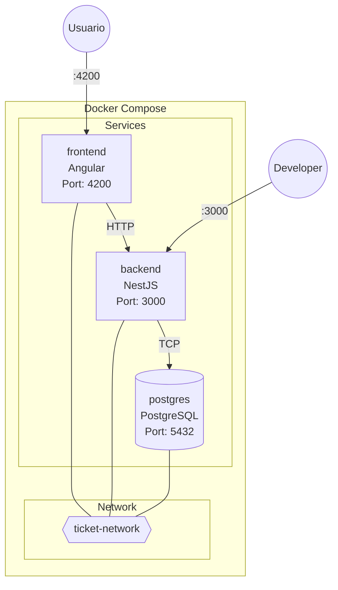
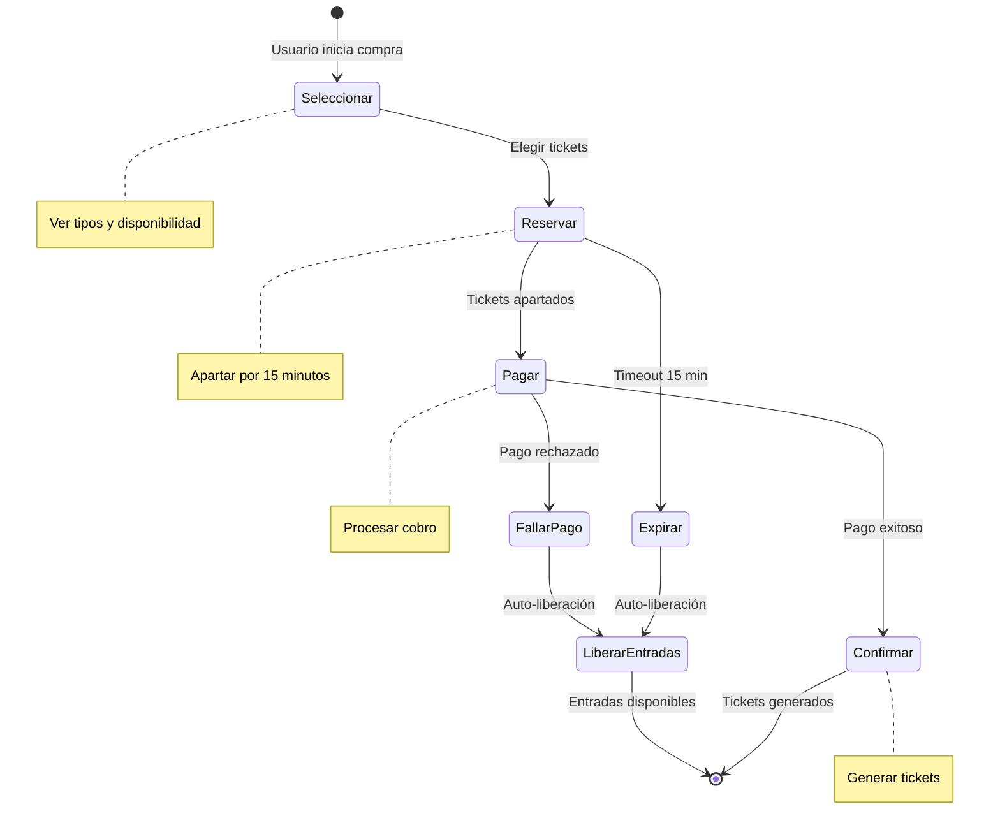

# Requirements Document

## Introduction

Sistema de venta de entradas para eventos que permite a los usuarios comprar diferentes tipos de tickets (VIP, General, Early Bird) con un proceso de reserva temporal y liberación automática de entradas cuando el pago falla.

### Stack Tecnológico

| Capa | Tecnología | Justificación |
|------|------------|---------------|
| **Frontend** | Angular 17+ | SPA con gestión de estado robusta |
| **Backend** | NestJS + TypeScript | Framework enterprise con DI nativa |
| **Base de Datos** | PostgreSQL + TypeORM | ACID para transacciones de pago |
| **Testing** | Jest + fast-check | Unit tests + Property-based testing |
| **Contenedores** | Docker + Docker Compose | Entorno reproducible y portable |

### Arquitectura de Contenedores

### Principios de Desarrollo

| Principio | Aplicación |
|-----------|------------|
| **SOLID** | Interfaces segregadas, inversión de dependencias, responsabilidad única |
| **Clean Code** | Nombres descriptivos, funciones pequeñas, código autoexplicativo |
| **Clean Architecture** | Capas independientes: Domain → Application → Infrastructure |
| **TDD** | Red-Green-Refactor para cada funcionalidad |
| **Tipado Estricto** | `strict: true` en tsconfig, sin `any` |

### Visión del Producto

> "Queremos que cualquier persona pueda comprar entradas para eventos de forma rápida y segura, con la tranquilidad de que sus entradas están reservadas mientras completa el pago."

### Stakeholders

| Rol | Interés Principal |
|-----|-------------------|
| **Cliente/Usuario** | Comprar entradas fácilmente sin perderlas durante el pago |
| **Organizador** | Gestionar eventos y maximizar ventas |
| **QA** | Verificar que el sistema funciona correctamente en todos los escenarios |
| **Desarrollo** | Implementar funcionalidades con código limpio, tipado estricto y testeable |
| **DevOps** | Desplegar y mantener el sistema de forma confiable con contenedores |

## Glossary

| Término | Definición | Ejemplo |
|---------|------------|---------|
| **Evento** | Actividad con fecha, lugar y entradas disponibles | Concierto de Rock - 15 Marzo 2025 |
| **Ticket** | Entrada que da acceso a un evento | Ticket VIP #ABC123 |
| **Tipo de Ticket** | Categoría de entrada con precio diferente | VIP, General, Early Bird |
| **Reserva** | Apartado temporal de entradas (15 min) | Reserva #R001 - 2 tickets VIP |
| **Disponibilidad** | Cantidad de entradas que se pueden comprar | 50 tickets VIP disponibles |

### Estados del Sistema

## Requirements

---

### Requirement 1: Crear y Gestionar Eventos

**User Story:** 
> Como **organizador de eventos**, quiero **crear eventos con diferentes tipos de entradas**, para que **los usuarios puedan comprar tickets para mis eventos**.

#### ¿Qué necesita el Cliente?
- Poder crear un evento con nombre, fecha y lugar
- Definir cuántas entradas hay de cada tipo (VIP, General, Early Bird)
- Establecer el precio de cada tipo de entrada

#### ¿Qué debe verificar QA?
- El evento se guarda correctamente con todos sus datos
- Se pueden definir los 3 tipos de entrada
- Los precios y cantidades son números válidos

#### ¿Qué debe implementar Desarrollo?
- **Controller**: `EventController` con decoradores NestJS (`@Post`, `@Get`)
- **Use Case**: `CreateEventUseCase` siguiendo SRP
- **Entity**: `Event` como clase de dominio inmutable
- **Repository Interface**: `IEventRepository` (DIP - inversión de dependencias)
- **Repository Impl**: `TypeOrmEventRepository` implementando la interfaz
- **DTO**: `CreateEventDto` con class-validator para validación
- **Tipado estricto**: Sin `any`, interfaces explícitas

#### ¿Qué necesita DevOps?
- Endpoint de health check para el servicio de eventos
- Logs estructurados para auditoría

#### Acceptance Criteria

1. WHEN un organizador crea un evento con nombre, fecha, ubicación y capacidad THEN el sistema SHALL persistir el evento y retornar un identificador único
2. WHEN un organizador define tipos de entrada para un evento THEN el sistema SHALL almacenar la configuración de cada tipo con su precio y cantidad disponible
3. WHEN se consulta un evento THEN el sistema SHALL retornar el evento con todos sus tipos de entrada y disponibilidad actual
4. IF un evento no existe THEN el sistema SHALL retornar un error con mensaje "Evento no encontrado"

---

### Requirement 2: Ver Tipos de Entradas Disponibles

**User Story:**
> Como **comprador**, quiero **ver los diferentes tipos de entradas disponibles (VIP, General, Early Bird)**, para **elegir la que mejor se adapte a mi presupuesto y preferencias**.

#### ¿Qué necesita el Cliente?
- Ver claramente qué tipos de entrada hay
- Ver el precio de cada tipo
- Saber cuántas entradas quedan de cada tipo

#### ¿Qué debe verificar QA?
- Se muestran los 3 tipos de entrada
- Los precios son correctos según la configuración
- La disponibilidad se actualiza en tiempo real

#### ¿Qué debe implementar Desarrollo?
- **Value Object**: `TicketType` enum con valores tipados
- **Strategy Pattern**: `IPricingStrategy` interface + implementaciones por tipo
- **Service**: `TicketAvailabilityService` con método `getAvailability(eventId: string): Promise<TicketAvailability[]>`
- **Caché**: Decorador `@Cacheable()` o servicio de caché inyectado
- **Tipado**: `TicketAvailability` interface con campos explícitos

#### Acceptance Criteria

1. El sistema SHALL soportar exactamente tres tipos de entrada: VIP, General y Early_Bird
2. WHEN se consultan entradas disponibles THEN el sistema SHALL retornar la cantidad disponible por cada tipo
3. WHEN se consulta el precio THEN el sistema SHALL retornar: VIP = precio base × 1.5, General = precio base, Early Bird = precio base × 0.8
4. WHILE un tipo tenga disponibilidad mayor a cero THEN el sistema SHALL permitir su selección
5. IF un tipo no tiene disponibilidad THEN el sistema SHALL mostrar "Agotado"

---

### Requirement 3: Reservar Entradas Temporalmente

**User Story:**
> Como **comprador**, quiero que **mis entradas se reserven mientras completo el pago**, para **no perderlas si alguien más intenta comprarlas al mismo tiempo**.

#### ¿Qué necesita el Cliente?
- Que nadie más pueda comprar las entradas que seleccionó
- Tener 15 minutos para completar el pago
- Ver un contador de tiempo restante

#### ¿Qué debe verificar QA?
- Las entradas se reservan inmediatamente al seleccionar
- La reserva expira exactamente a los 15 minutos
- Las entradas se liberan automáticamente al expirar

#### ¿Qué debe implementar Desarrollo?
- **State Pattern**: `IReservationState` interface + estados concretos (`ActiveState`, `ConfirmedState`, `ExpiredState`, `CancelledState`)
- **Entity**: `Reservation` con método `setState(state: IReservationState): void`
- **Use Case**: `CreateReservationUseCase` con transacción atómica
- **Scheduler**: `@Cron()` decorator de NestJS para job de expiración
- **Repository**: `IReservationRepository` con método `findExpired(): Promise<Reservation[]>`
- **Tipado**: `ReservationStatus` type union literal

#### ¿Qué necesita DevOps?
- Monitoreo del job de expiración
- Alertas si hay reservas sin procesar

#### Acceptance Criteria

1. WHEN un comprador selecciona entradas THEN el sistema SHALL crear una reserva con estado "Activa" y expiración en 15 minutos
2. WHILE una reserva está activa THEN el sistema SHALL decrementar la disponibilidad del tipo correspondiente
3. WHEN el tiempo de reserva expira THEN el sistema SHALL cambiar el estado a "Expirada" y liberar las entradas
4. WHEN se crea una reserva THEN el sistema SHALL retornar un identificador único
5. IF no hay suficientes entradas THEN el sistema SHALL rechazar con mensaje "No hay suficientes entradas disponibles"

---

### Requirement 4: Procesar Pago de Entradas

**User Story:**
> Como **comprador**, quiero **pagar mis entradas de forma segura**, para **completar mi compra y recibir mis tickets**.

#### ¿Qué necesita el Cliente?
- Proceso de pago simple y seguro
- Confirmación inmediata de la compra
- Recibir sus tickets al completar el pago

#### ¿Qué debe verificar QA?
- El monto cobrado es correcto
- Los tickets se generan con datos correctos
- El estado de la reserva cambia a "Confirmada"

#### ¿Qué debe implementar Desarrollo?
- **Adapter Pattern**: `IPaymentGateway` interface + `StripePaymentAdapter` implementación
- **Use Case**: `ProcessPaymentUseCase` orquestando pago → confirmación → generación
- **Factory Pattern**: `TicketFactory` para crear tickets con código único
- **Transaction**: `@Transaction()` decorator o `QueryRunner` de TypeORM
- **Event Emitter**: `PaymentCompletedEvent` para desacoplar generación de tickets
- **Tipado**: `PaymentResult` type con discriminated union para éxito/fallo

#### ¿Qué necesita DevOps?
- Logs de transacciones de pago
- Monitoreo de tasa de éxito/fallo

#### Acceptance Criteria

1. WHEN un comprador paga una reserva activa THEN el sistema SHALL procesar el pago con el monto total calculado
2. WHEN el pago es exitoso THEN el sistema SHALL actualizar el estado del pago a "Completado"
3. WHEN el pago es exitoso THEN el sistema SHALL cambiar el estado de la reserva a "Confirmada"
4. WHEN el pago es exitoso THEN el sistema SHALL generar los tickets con código único, evento, tipo y datos del comprador
5. IF el pago falla THEN el sistema SHALL actualizar el estado del pago a "Fallido"

---

### Requirement 5: Liberar Entradas por Pago Fallido

**User Story:**
> Como **sistema**, quiero **liberar automáticamente las entradas cuando un pago falla**, para que **otros compradores puedan adquirirlas**.

#### ¿Qué necesita el Cliente?
- Que las entradas vuelvan a estar disponibles rápidamente
- Notificación de que su pago falló

#### ¿Qué debe verificar QA?
- Las entradas se liberan en menos de 5 segundos
- La disponibilidad se incrementa correctamente
- Se registra el motivo de la liberación

#### ¿Qué debe implementar Desarrollo?
- **Observer Pattern**: `@OnEvent('payment.failed')` handler de NestJS
- **Use Case**: `ReleaseTicketsUseCase` con lógica de liberación
- **Retry Policy**: Clase `RetryPolicy<T>` genérica con backoff exponencial
- **Domain Event**: `TicketReleasedEvent` con timestamp y motivo
- **Logger**: Inyección de `ILogger` interface para registro estructurado
- **Tipado**: `ReleaseResult` type con información de éxito/fallo/reintentos

#### ¿Qué necesita DevOps?
- Alertas si la liberación falla después de 3 intentos
- Dashboard de entradas liberadas por día

#### Acceptance Criteria

1. WHEN el pago falla THEN el sistema SHALL cambiar el estado de la reserva a "Cancelada"
2. WHEN una reserva se cancela THEN el sistema SHALL incrementar la disponibilidad del tipo correspondiente
3. WHEN se liberan entradas THEN el sistema SHALL registrar: timestamp, motivo y cantidad liberada
4. El sistema SHALL procesar la liberación en menos de 5 segundos
5. IF la liberación falla THEN el sistema SHALL reintentar hasta 3 veces antes de escalar a intervención manual

---

### Requirement 6: Consultar Tickets Comprados

**User Story:**
> Como **comprador**, quiero **ver mis tickets comprados**, para **acceder a ellos cuando los necesite**.

#### ¿Qué necesita el Cliente?
- Ver todos sus tickets en un solo lugar
- Información clara de cada ticket (evento, tipo, código)
- Poder descargar o mostrar el ticket

#### ¿Qué debe verificar QA?
- Solo se muestran tickets confirmados
- La información del ticket es completa
- Compradores sin tickets ven lista vacía (sin error)

#### Acceptance Criteria

1. WHEN un comprador consulta sus tickets THEN el sistema SHALL retornar todos los tickets con estado "Confirmado"
2. WHEN se retorna un ticket THEN el sistema SHALL incluir: código único, nombre del evento, tipo de entrada, fecha de compra
3. IF el comprador no tiene tickets THEN el sistema SHALL retornar una lista vacía sin error

---

### Requirement 7: Validar Datos de Entrada

**User Story:**
> Como **sistema**, quiero **validar todos los datos de entrada**, para **garantizar la integridad de la información y prevenir errores**.

#### ¿Qué necesita el Cliente?
- Mensajes de error claros cuando algo está mal
- Saber exactamente qué campo corregir

#### ¿Qué debe verificar QA?
- Cantidad de entradas: entre 1 y 10
- Email con formato válido
- Monto de pago coincide con el total

#### ¿Qué debe implementar Desarrollo?
- **Value Objects**: `Email`, `Money`, `TicketQuantity` con validación en constructor
- **Validation Pipe**: `ValidationPipe` global de NestJS con class-validator
- **Custom Decorators**: `@IsValidEmail()`, `@IsPositiveMoney()` para DTOs
- **Exception Filter**: `DomainExceptionFilter` para mapear errores a HTTP responses
- **Tipado**: `ValidationError` interface con `field`, `message`, `code`

#### Acceptance Criteria

1. WHEN se recibe una reserva THEN el sistema SHALL validar que la cantidad sea mayor a 0 y menor o igual a 10
2. WHEN se recibe un pago THEN el sistema SHALL validar que el monto coincida con el total de la reserva
3. IF los datos son inválidos THEN el sistema SHALL retornar error con campo y razón específica
4. WHEN se valida un email THEN el sistema SHALL verificar formato válido (contiene @ y dominio)

---

### Requirement 8: Persistir y Recuperar Datos

**User Story:**
> Como **sistema**, quiero **persistir y recuperar datos de forma consistente**, para **mantener la integridad de la información**.

#### ¿Qué necesita el Cliente?
- Que sus datos no se pierdan
- Que la información sea consistente

#### ¿Qué debe verificar QA?
- Guardar y recuperar produce datos idénticos
- No hay pérdida de información en conversiones

#### ¿Qué debe implementar Desarrollo?
- **Mapper Pattern**: `EventMapper` clase con métodos `toDomain()` y `toPersistence()`
- **TypeORM Entities**: `EventEntity`, `TicketEntity` separadas de entidades de dominio
- **Repository Pattern**: Implementación con TypeORM `Repository<T>`
- **Serialization**: `class-transformer` para JSON ↔ Object
- **Tests**: Property-based tests con fast-check para round-trip
- **Tipado**: Generics `Mapper<Domain, Persistence>` para type safety

#### Acceptance Criteria

1. WHEN se persiste una entidad THEN el sistema SHALL serializar los datos a formato JSON
2. WHEN se recupera una entidad THEN el sistema SHALL deserializar los datos a objetos de dominio
3. FOR ALL entidades válidas, serializar y deserializar SHALL producir un objeto equivalente al original

---

## Resumen de Criterios de Aceptación

| Req | Criterios | Testeable como Propiedad |
|-----|-----------|--------------------------|
| 1 | 4 | 3 propiedades + 1 ejemplo |
| 2 | 5 | 4 propiedades + 1 edge case |
| 3 | 5 | 4 propiedades + 1 edge case |
| 4 | 5 | 5 propiedades |
| 5 | 5 | 4 propiedades + 1 ejemplo |
| 6 | 3 | 2 propiedades + 1 edge case |
| 7 | 4 | 4 propiedades |
| 8 | 3 | 1 propiedad round-trip |

**Total: 34 criterios de aceptación → 12 propiedades consolidadas para TDD**
