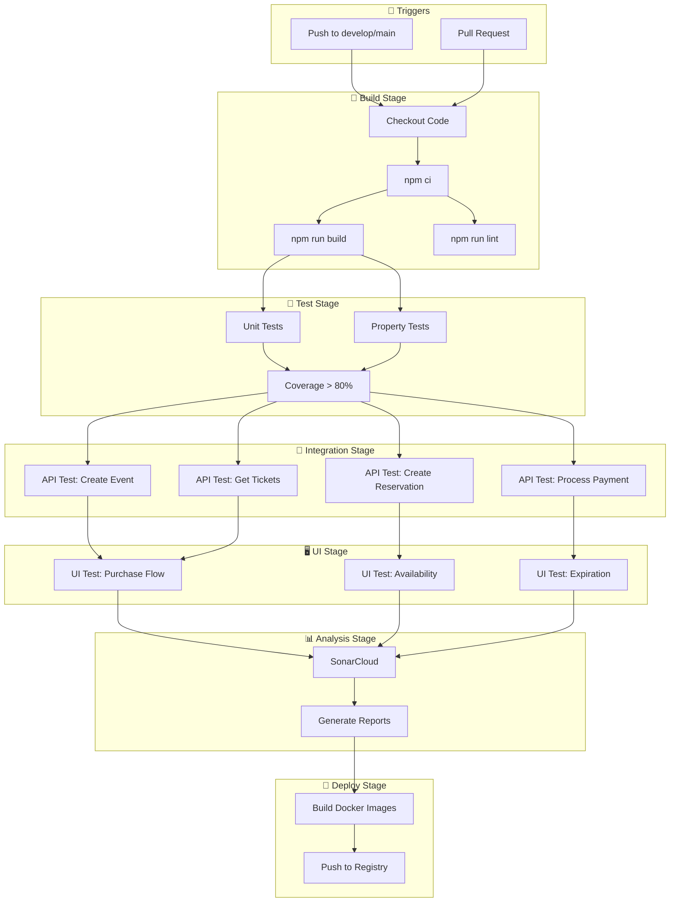

# Implementation Plan: Ticket Sales System

## Overview

Plan de implementación siguiendo metodología **TDD (Test-Driven Development)** con ciclo **Red-Green-Refactor**. Cada tarea sigue el patrón:

1. 🔴 **RED**: Escribir test que falla
2. 🟢 **GREEN**: Escribir código mínimo para pasar
3. 🔵 **REFACTOR**: Mejorar código sin romper tests

### Stack Tecnológico
- **Backend**: NestJS + TypeScript (strict mode)
- **Database**: PostgreSQL + TypeORM
- **Testing**: Jest + fast-check

---

## Tasks

### Fase 1: Setup y Configuración Base

- [x] 1. Configurar estructura de proyecto monorepo con Docker
  - Crear estructura de directorios: `/backend`, `/frontend`, `/docker`
  - Crear `docker-compose.yml` con servicios: postgres, backend, frontend, test-db
  - Crear `Dockerfile` multi-stage para backend (development, builder, production)
  - Crear `Dockerfile` multi-stage para frontend (development, builder, production)
  - Crear `.dockerignore` para ambos proyectos
  - Crear `nginx.conf` para frontend en producción
  - _Requirements: Setup, DevOps_

- [x] 2. Configurar proyecto NestJS con TypeScript estricto
  - Crear proyecto NestJS con `nest new backend`
  - Configurar `tsconfig.json` con `strict: true`, `noImplicitAny: true`
  - Instalar dependencias: `typeorm`, `pg`, `class-validator`, `class-transformer`, `fast-check`
  - Configurar Jest para tests unitarios y de propiedades
  - Crear estructura de directorios según Clean Architecture
  - Configurar variables de entorno para Docker
  - _Requirements: Setup_

- [x] 3. Configurar base de datos PostgreSQL con Docker
  - Verificar que contenedor postgres inicia correctamente: `docker-compose up postgres`
  - Crear archivo `typeorm.config.ts` con configuración de conexión usando variables de entorno
  - Crear migraciones para tablas: `events`, `ticket_configurations`, `reservations`, `tickets`, `payments`
  - Ejecutar migraciones dentro del contenedor: `docker-compose exec backend npm run migration:run`
  - Verificar esquema de base de datos
  - _Requirements: 8.1, 8.2_

- [x] 4. Verificar entorno Docker completo
  - Ejecutar `docker-compose up -d` y verificar que todos los servicios inician
  - Verificar conectividad entre backend y postgres
  - Verificar que hot-reload funciona en desarrollo
  - Crear script `npm run docker:dev` para desarrollo
  - Crear script `npm run docker:test` para tests con base de datos de prueba
  - _Requirements: Setup, DevOps_

---

### Fase 2: Value Objects (TDD)

- [ ] 3. Implementar Value Object `Money` con TDD
  - [x] 3.1 🔴 Escribir tests unitarios para `Money` (creación, add, multiply, equals)
    - Test: crear Money con amount válido debe funcionar
    - Test: crear Money con amount negativo debe lanzar excepción
    - Test: add de dos Money con misma moneda debe sumar correctamente
    - Test: multiply debe calcular correctamente
    - Commit: crear commit y push
    - _Requirements: 2.3, 7.2_
  - [ ] 3.2 🟢 Implementar clase `Money` para pasar los tests
    - Implementar constructor privado con validación
    - Implementar método estático `create()`
    - Implementar métodos `add()`, `multiply()`, `equals()`
    - _Requirements: 2.3, 7.2_
  - [ ] 3.3 🔵 Escribir property test para `Money`
    - **Property 11: Price Calculation by Ticket Type**
    - **Validates: Requirements 2.3**

- [ ] 4. Implementar Value Object `Email` con TDD
  - [ ] 4.1 🔴 Escribir tests unitarios para `Email`
    - Test: crear Email con formato válido debe funcionar
    - Test: crear Email con formato inválido debe lanzar excepción
    - Test: emails equivalentes (case insensitive) deben ser iguales
    - _Requirements: 7.4_
  - [ ] 4.2 🟢 Implementar clase `Email` para pasar los tests
    - Implementar validación con regex
    - Implementar normalización (lowercase, trim)
    - _Requirements: 7.4_
  - [ ] 4.3 🔵 Escribir property test para `Email`
    - **Property 10: Email Format Validation**
    - **Validates: Requirements 7.4**

- [ ] 5. Implementar Value Object `TicketQuantity` con TDD
  - [ ] 5.1 🔴 Escribir tests unitarios para `TicketQuantity`
    - Test: crear con cantidad entre 1-10 debe funcionar
    - Test: crear con cantidad 0 debe lanzar excepción
    - Test: crear con cantidad > 10 debe lanzar excepción
    - _Requirements: 7.1_
  - [ ] 5.2 🟢 Implementar clase `TicketQuantity` para pasar los tests
    - Implementar validación de rango [1, 10]
    - _Requirements: 7.1_
  - [ ] 5.3 🔵 Escribir property test para `TicketQuantity`
    - **Property 8: Reservation Quantity Validation**
    - **Validates: Requirements 7.1**

- [ ] 6. Checkpoint - Value Objects
  - Ejecutar todos los tests: `npm test`
  - Verificar cobertura de tests
  - Ensure all tests pass, ask the user if questions arise.

---

### Fase 3: Entidades de Dominio (TDD)

- [ ] 7. Implementar entidad `Event` con TDD
  - [ ] 7.1 🔴 Escribir tests unitarios para `Event`
    - Test: crear Event con datos válidos
    - Test: getAvailability retorna cantidad correcta por tipo
    - Test: reserveTickets decrementa disponibilidad
    - Test: releaseTickets incrementa disponibilidad
    - Test: reserveTickets con cantidad insuficiente lanza excepción
    - _Requirements: 1.1, 1.2, 1.3, 3.2, 5.2_
  - [ ] 7.2 🟢 Implementar clase `Event` para pasar los tests
    - Implementar constructor con validación
    - Implementar `getAvailability()`, `reserveTickets()`, `releaseTickets()`
    - _Requirements: 1.1, 1.2, 1.3, 3.2, 5.2_
  - [ ] 7.3 🔵 Escribir property test para invariante de disponibilidad
    - **Property 2: Ticket Availability Invariant**
    - **Validates: Requirements 3.2, 5.2**

- [ ] 8. Implementar patrón State para `Reservation` con TDD
  - [ ] 8.1 🔴 Escribir tests para estados de reserva
    - Test: ActiveState permite confirm, cancel, expire
    - Test: ConfirmedState no permite ninguna transición
    - Test: ExpiredState no permite ninguna transición
    - Test: CancelledState no permite ninguna transición
    - _Requirements: 3.1, 3.3, 5.1_
  - [ ] 8.2 🟢 Implementar interface `IReservationState` y estados concretos
    - Implementar `ActiveReservationState`
    - Implementar `ConfirmedReservationState`
    - Implementar `ExpiredReservationState`
    - Implementar `CancelledReservationState`
    - _Requirements: 3.1, 3.3, 5.1_
  - [ ] 8.3 🔵 Escribir property test para máquina de estados
    - **Property 6: Reservation State Machine Validity**
    - **Validates: Requirements 3.1, 3.3, 5.1**

- [ ] 9. Implementar entidad `Reservation` con TDD
  - [ ] 9.1 🔴 Escribir tests unitarios para `Reservation`
    - Test: crear Reservation con estado inicial Active
    - Test: confirm() cambia estado a Confirmed
    - Test: cancel() cambia estado a Cancelled
    - Test: expire() cambia estado a Expired
    - Test: isExpired retorna true cuando expiresAt < now
    - _Requirements: 3.1, 3.3, 3.4, 4.3, 5.1_
  - [ ] 9.2 🟢 Implementar clase `Reservation` para pasar los tests
    - Implementar constructor con estado inicial
    - Implementar métodos de transición usando State Pattern
    - _Requirements: 3.1, 3.3, 3.4, 4.3, 5.1_

- [ ] 10. Implementar entidad `Ticket` con TDD
  - [ ] 10.1 🔴 Escribir tests unitarios para `Ticket`
    - Test: crear Ticket con todos los campos requeridos
    - Test: toJSON() retorna objeto con todos los campos
    - _Requirements: 4.4, 6.2_
  - [ ] 10.2 🟢 Implementar clase `Ticket` para pasar los tests
    - Implementar constructor con validación
    - Implementar método `toJSON()`
    - _Requirements: 4.4, 6.2_

- [ ] 11. Checkpoint - Entidades de Dominio
  - Ejecutar todos los tests: `npm test`
  - Verificar que property tests pasan con 100 iteraciones
  - Ensure all tests pass, ask the user if questions arise.

---

### Fase 4: Estrategias de Precio (TDD)

- [ ] 12. Implementar patrón Strategy para precios con TDD
  - [ ] 12.1 🔴 Escribir tests para estrategias de precio
    - Test: VipPricingStrategy calcula precio × 1.5
    - Test: GeneralPricingStrategy calcula precio × 1.0
    - Test: EarlyBirdPricingStrategy calcula precio × 0.8
    - _Requirements: 2.3_
  - [ ] 12.2 🟢 Implementar interface `IPricingStrategy` y estrategias concretas
    - Implementar `VipPricingStrategy`
    - Implementar `GeneralPricingStrategy`
    - Implementar `EarlyBirdPricingStrategy`
    - _Requirements: 2.3_
  - [ ] 12.3 🔵 Escribir property test para cálculo de precios
    - **Property 11: Price Calculation by Ticket Type**
    - **Validates: Requirements 2.3**

- [ ] 13. Implementar `PricingService` con TDD
  - [ ] 13.1 🔴 Escribir tests para PricingService
    - Test: calculatePrice usa estrategia correcta según tipo
    - Test: lanza error si tipo no tiene estrategia
    - _Requirements: 2.3_
  - [ ] 13.2 🟢 Implementar `PricingService` para pasar los tests
    - Inyectar estrategias en constructor
    - Implementar `calculatePrice()`
    - _Requirements: 2.3_

---

### Fase 5: Repositorios e Infraestructura (TDD)

- [ ] 14. Implementar interfaces de repositorio
  - Crear `IEventRepository` con métodos: save, findById, findAll, update
  - Crear `ITicketRepository` con métodos: save, saveMany, findByBuyer, findByEvent
  - Crear `IReservationRepository` con métodos: save, findById, findExpired, update
  - Crear tokens de inyección para DIP
  - _Requirements: 1.1, 1.3, 6.1_

- [ ] 15. Implementar `TypeOrmEventRepository` con TDD
  - [ ] 15.1 🔴 Escribir tests de integración para EventRepository
    - Test: save persiste evento y retorna con ID
    - Test: findById retorna evento existente
    - Test: findById retorna null para ID inexistente
    - _Requirements: 1.1, 1.3, 1.4_
  - [ ] 15.2 🟢 Implementar `TypeOrmEventRepository` para pasar los tests
    - Implementar mapper Event ↔ EventOrmEntity
    - Implementar métodos del repositorio
    - _Requirements: 1.1, 1.3, 1.4_
  - [ ] 15.3 🔵 Escribir property test para round-trip de persistencia
    - **Property 1: Event Persistence Round-Trip**
    - **Validates: Requirements 1.1, 1.3, 8.3**

- [ ] 16. Implementar `TypeOrmReservationRepository` con TDD
  - [ ] 16.1 🔴 Escribir tests de integración para ReservationRepository
    - Test: save persiste reserva
    - Test: findExpired retorna reservas con expiresAt < now y status ACTIVE
    - Test: update actualiza estado correctamente
    - _Requirements: 3.1, 3.3, 3.4_
  - [ ] 16.2 🟢 Implementar `TypeOrmReservationRepository` para pasar los tests
    - Implementar mapper Reservation ↔ ReservationOrmEntity
    - Implementar métodos del repositorio
    - _Requirements: 3.1, 3.3, 3.4_

- [ ] 17. Implementar `TypeOrmTicketRepository` con TDD
  - [ ] 17.1 🔴 Escribir tests de integración para TicketRepository
    - Test: save persiste ticket
    - Test: findByBuyer retorna tickets del comprador
    - _Requirements: 4.4, 6.1_
  - [ ] 17.2 🟢 Implementar `TypeOrmTicketRepository` para pasar los tests
    - Implementar mapper Ticket ↔ TicketOrmEntity
    - Implementar métodos del repositorio
    - _Requirements: 4.4, 6.1_
  - [ ] 17.3 🔵 Escribir property test para serialización round-trip
    - **Property 5: Entity Serialization Round-Trip**
    - **Validates: Requirements 8.3**

- [ ] 18. Checkpoint - Repositorios
  - Ejecutar tests de integración con base de datos de prueba
  - Verificar que mappers funcionan correctamente
  - Ensure all tests pass, ask the user if questions arise.

---

### Fase 6: Casos de Uso (TDD)

- [ ] 19. Implementar `CreateEventUseCase` con TDD
  - [ ] 19.1 🔴 Escribir tests para CreateEventUseCase
    - Test: crea evento con configuraciones de tickets
    - Test: valida datos de entrada
    - Test: retorna evento creado con ID
    - _Requirements: 1.1, 1.2_
  - [ ] 19.2 🟢 Implementar `CreateEventUseCase` para pasar los tests
    - Inyectar IEventRepository
    - Implementar método execute()
    - _Requirements: 1.1, 1.2_

- [ ] 20. Implementar `CreateReservationUseCase` con TDD
  - [ ] 20.1 🔴 Escribir tests para CreateReservationUseCase
    - Test: crea reserva y decrementa disponibilidad
    - Test: rechaza si no hay suficientes tickets
    - Test: establece expiración a 15 minutos
    - _Requirements: 3.1, 3.2, 3.4, 3.5_
  - [ ] 20.2 🟢 Implementar `CreateReservationUseCase` para pasar los tests
    - Inyectar IEventRepository, IReservationRepository
    - Implementar transacción atómica
    - _Requirements: 3.1, 3.2, 3.4, 3.5_
  - [ ] 20.3 🔵 Escribir property test para disponibilidad
    - **Property 12: Availability Reflects Reservations**
    - **Validates: Requirements 2.2, 2.4, 2.5**

- [ ] 21. Implementar `ProcessPaymentUseCase` con TDD
  - [ ] 21.1 🔴 Escribir tests para ProcessPaymentUseCase
    - Test: pago exitoso confirma reserva y genera tickets
    - Test: pago fallido cancela reserva y libera tickets
    - Test: valida que monto coincide con total de reserva
    - _Requirements: 4.1, 4.2, 4.3, 4.4, 4.5_
  - [ ] 21.2 🟢 Implementar `ProcessPaymentUseCase` para pasar los tests
    - Inyectar IPaymentGateway, IReservationRepository, ITicketRepository, IEventRepository
    - Implementar flujo de pago con transacción
    - _Requirements: 4.1, 4.2, 4.3, 4.4, 4.5_
  - [ ] 21.3 🔵 Escribir property tests para flujos de pago
    - **Property 3: Successful Payment State Transitions**
    - **Property 4: Failed Payment Triggers Ticket Release**
    - **Validates: Requirements 4.2, 4.3, 4.4, 4.5, 5.1, 5.2**

- [ ] 22. Implementar `ReleaseTicketsUseCase` con TDD
  - [ ] 22.1 🔴 Escribir tests para ReleaseTicketsUseCase
    - Test: libera tickets e incrementa disponibilidad
    - Test: registra evento de liberación con timestamp y motivo
    - Test: reintenta hasta 3 veces si falla
    - _Requirements: 5.1, 5.2, 5.3, 5.5_
  - [ ] 22.2 🟢 Implementar `ReleaseTicketsUseCase` para pasar los tests
    - Inyectar IEventRepository, IReservationRepository
    - Implementar RetryPolicy
    - _Requirements: 5.1, 5.2, 5.3, 5.5_

- [ ] 23. Implementar `GetBuyerTicketsUseCase` con TDD
  - [ ] 23.1 🔴 Escribir tests para GetBuyerTicketsUseCase
    - Test: retorna tickets confirmados del comprador
    - Test: retorna lista vacía si no tiene tickets
    - Test: cada ticket incluye todos los campos requeridos
    - _Requirements: 6.1, 6.2, 6.3_
  - [ ] 23.2 🟢 Implementar `GetBuyerTicketsUseCase` para pasar los tests
    - Inyectar ITicketRepository
    - Implementar método execute()
    - _Requirements: 6.1, 6.2, 6.3_
  - [ ] 23.3 🔵 Escribir property test para consulta de tickets
    - **Property 7: Buyer Ticket Query Completeness**
    - **Validates: Requirements 6.1, 6.2**

- [ ] 24. Checkpoint - Casos de Uso
  - Ejecutar todos los tests unitarios y de propiedades
  - Verificar cobertura > 80%
  - Ensure all tests pass, ask the user if questions arise.

---

### Fase 7: Controladores y API (TDD)

- [ ] 25. Implementar `EventController` con TDD
  - [ ] 25.1 🔴 Escribir tests de integración para EventController
    - Test: POST /events crea evento y retorna 201
    - Test: GET /events/:id retorna evento existente
    - Test: GET /events/:id retorna 404 para ID inexistente
    - _Requirements: 1.1, 1.3, 1.4_
  - [ ] 25.2 🟢 Implementar `EventController` para pasar los tests
    - Crear DTOs con class-validator
    - Implementar endpoints REST
    - _Requirements: 1.1, 1.3, 1.4_

- [ ] 26. Implementar `ReservationController` con TDD
  - [ ] 26.1 🔴 Escribir tests de integración para ReservationController
    - Test: POST /reservations crea reserva y retorna 201
    - Test: POST /reservations retorna 409 si no hay disponibilidad
    - Test: POST /reservations/:id/payment procesa pago
    - _Requirements: 3.1, 3.5, 4.1_
  - [ ] 26.2 🟢 Implementar `ReservationController` para pasar los tests
    - Crear DTOs con validación
    - Implementar endpoints REST
    - _Requirements: 3.1, 3.5, 4.1_

- [ ] 27. Implementar `TicketController` con TDD
  - [ ] 27.1 🔴 Escribir tests de integración para TicketController
    - Test: GET /tickets?email=x retorna tickets del comprador
    - Test: GET /tickets?email=x retorna lista vacía si no tiene
    - _Requirements: 6.1, 6.3_
  - [ ] 27.2 🟢 Implementar `TicketController` para pasar los tests
    - Crear DTOs de respuesta
    - Implementar endpoint REST
    - _Requirements: 6.1, 6.3_

- [ ] 28. Implementar `DomainExceptionFilter`
  - Crear filtro global para excepciones de dominio
  - Mapear códigos de error a HTTP status codes
  - Formatear respuestas de error consistentes
  - _Requirements: 1.4, 3.5, 7.3_

---

### Fase 8: Autenticación y Usuarios (TDD)

- [ ] 29. Implementar entidad `User` con TDD
  - [ ] 29.1 🔴 Escribir tests unitarios para `User`
    - Test: crear User con datos válidos
    - Test: hashear password correctamente
    - Test: verificar password correcto retorna true
    - Test: verificar password incorrecto retorna false
    - _Requirements: 9.1, 9.2_
  - [ ] 29.2 🟢 Implementar clase `User` para pasar los tests
    - Implementar constructor con validación
    - Implementar métodos `hashPassword()`, `verifyPassword()`
    - Usar bcrypt para hashing
    - _Requirements: 9.1, 9.2_

- [ ] 30. Implementar `AuthService` con TDD
  - [ ] 30.1 🔴 Escribir tests para AuthService
    - Test: register crea usuario y retorna tokens
    - Test: login con credenciales válidas retorna tokens
    - Test: login con credenciales inválidas lanza excepción
    - Test: refreshToken genera nuevo accessToken
    - _Requirements: 9.1, 9.2, 9.3_
  - [ ] 30.2 🟢 Implementar `AuthService` para pasar los tests
    - Inyectar IUserRepository, JwtService
    - Implementar métodos register, login, refreshToken
    - Generar JWT con payload correcto
    - _Requirements: 9.1, 9.2, 9.3_
  - [ ] 30.3 🔵 Escribir property test para JWT
    - **Property 13: JWT Token Validity**
    - **Validates: Requirements 9.2, 9.3**

- [ ] 31. Implementar `AuthController` con TDD
  - [ ] 31.1 🔴 Escribir tests de integración para AuthController
    - Test: POST /auth/register crea usuario y retorna 201
    - Test: POST /auth/login retorna tokens con 200
    - Test: POST /auth/login retorna 401 con credenciales inválidas
    - Test: POST /auth/refresh retorna nuevo token
    - _Requirements: 9.1, 9.2, 9.3, 9.4_
  - [ ] 31.2 🟢 Implementar `AuthController` para pasar los tests
    - Crear DTOs: LoginDto, RegisterDto, RefreshTokenDto
    - Implementar endpoints REST
    - _Requirements: 9.1, 9.2, 9.3, 9.4_

- [ ] 32. Implementar Guards de Autenticación
  - [ ] 32.1 Crear JwtAuthGuard
    - Validar token JWT en header Authorization
    - Extraer usuario del token y agregarlo a request
    - _Requirements: 9.2_
  - [ ] 32.2 Crear RoleGuard
    - Verificar que usuario tiene rol requerido
    - Retornar 403 si no tiene permisos
    - _Requirements: 11.4_

- [ ] 33. Implementar `ProfileController` con TDD
  - [ ] 33.1 🔴 Escribir tests para ProfileController
    - Test: GET /profile retorna datos del usuario autenticado
    - Test: PUT /profile actualiza datos
    - Test: PUT /profile/password cambia contraseña
    - Test: GET /profile/purchases retorna historial
    - _Requirements: 10.1, 10.2, 10.3, 10.4_
  - [ ] 33.2 🟢 Implementar `ProfileController` para pasar los tests
    - Crear DTOs: UpdateProfileDto, ChangePasswordDto
    - Implementar endpoints protegidos con JwtAuthGuard
    - _Requirements: 10.1, 10.2, 10.3, 10.4_

- [ ] 34. Implementar `OrganizerController` con TDD
  - [ ] 34.1 🔴 Escribir tests para OrganizerController
    - Test: GET /organizer/events retorna eventos del organizador
    - Test: POST /organizer/events crea evento (solo ORGANIZER)
    - Test: GET /organizer/events/:id/stats retorna estadísticas
    - Test: POST /organizer/events retorna 403 para BUYER
    - _Requirements: 11.1, 11.2, 11.3, 11.4_
  - [ ] 34.2 🟢 Implementar `OrganizerController` para pasar los tests
    - Usar RoleGuard para verificar rol ORGANIZER
    - Implementar endpoints de gestión de eventos
    - _Requirements: 11.1, 11.2, 11.3, 11.4_

- [ ] 35. Checkpoint - Autenticación y Usuarios
  - Ejecutar todos los tests de auth
  - Verificar que guards funcionan correctamente
  - Ensure all tests pass, ask the user if questions arise.

---

### Fase 9: Jobs y Eventos de Dominio

- [ ] 36. Implementar job de expiración de reservas con TDD
  - [ ] 36. Implementar job de expiración de reservas con TDD
  - [ ] 36.1 🔴 Escribir tests para ReservationExpirationJob
    - Test: encuentra reservas expiradas y las procesa
    - Test: libera tickets de reservas expiradas
    - _Requirements: 3.3_
  - [ ] 36.2 🟢 Implementar `ReservationExpirationJob` para pasar los tests
    - Usar @Cron decorator de NestJS
    - Ejecutar cada minuto
    - _Requirements: 3.3_

- [ ] 37. Implementar handlers de eventos de dominio
  - Implementar `PaymentFailedHandler` con @OnEvent
  - Implementar `TicketReleasedHandler` para logging
  - Configurar EventEmitter2 en módulo
  - _Requirements: 5.1, 5.3_

---

### Fase 10: Integración Final, E2E y Docker Production

- [ ] 38. Configurar módulos NestJS
  - Crear `EventModule` con providers y exports
  - Crear `ReservationModule` con providers y exports
  - Crear `TicketModule` con providers y exports
  - Crear `PaymentModule` con adapter de Stripe
  - Crear `AuthModule` con JWT y guards
  - Crear `ProfileModule` con servicios de perfil
  - Configurar inyección de dependencias
  - _Requirements: Setup_

- [ ] 39. Escribir tests E2E del flujo completo
  - [ ] 39.1 Test E2E: Flujo de compra exitosa
    - Registrar usuario → Login → Crear reserva → Procesar pago → Verificar tickets
    - Ejecutar con: `docker-compose --profile test up -d && npm run test:e2e`
    - _Requirements: 1.1, 3.1, 4.1, 6.1, 9.1, 9.2_
  - [ ] 39.2 Test E2E: Flujo de pago fallido
    - Login → Crear reserva → Pago falla → Verificar liberación
    - _Requirements: 3.1, 4.5, 5.1, 5.2_
  - [ ] 39.3 Test E2E: Expiración de reserva
    - Login → Crear reserva → Esperar expiración → Verificar liberación
    - _Requirements: 3.3_
  - [ ] 39.4 Test E2E: Flujo de organizador
    - Registrar organizador → Login → Crear evento → Verificar estadísticas
    - _Requirements: 11.1, 11.2, 11.3_

- [ ] 40. Configurar Docker para producción
  - Crear `docker-compose.prod.yml` con configuración de producción
  - Configurar health checks para todos los servicios
  - Configurar logging centralizado
  - Crear script `npm run docker:build` para construir imágenes de producción
  - Crear script `npm run docker:prod` para ejecutar en modo producción
  - Documentar comandos de despliegue en README.md
  - _Requirements: DevOps_

- [ ] 41. Checkpoint Final Pre-CI/CD
  - Ejecutar suite completa de tests: `docker-compose exec backend npm test`
  - Ejecutar tests E2E: `docker-compose --profile test exec backend npm run test:e2e`
  - Verificar cobertura total > 80%
  - Verificar que todos los property tests pasan con 100 iteraciones
  - Verificar que imágenes de producción construyen correctamente
  - Ensure all tests pass, ask the user if questions arise.

---

### Fase 11: CI/CD Pipeline y Pruebas Automatizadas

- [ ] 42. Configurar GitHub Actions CI Pipeline
  - [ ] 42.1 Crear workflow `.github/workflows/ci.yml`
    - Trigger en push a `develop` y `main`
    - Trigger en pull requests a `develop` y `main`
    - Configurar matriz de Node.js versiones (18.x, 20.x)
    - _Requirements: DevOps, CI/CD_
  - [ ] 42.2 Configurar job de Build/Compilación
    - Checkout del código
    - Setup Node.js con cache de npm
    - Instalar dependencias: `npm ci`
    - Compilar TypeScript: `npm run build`
    - Verificar que no hay errores de compilación
    - _Requirements: DevOps, CI/CD_
  - [ ] 42.3 Configurar job de Tests Unitarios
    - Ejecutar tests unitarios: `npm run test`
    - Generar reporte de cobertura
    - Fallar si cobertura < 80%
    - Subir artefactos de cobertura
    - _Requirements: DevOps, CI/CD_
  - [ ] 42.4 Configurar job de Tests de Propiedades
    - Ejecutar property tests: `npm run test:property`
    - Verificar que todos los property tests pasan con 100 iteraciones
    - _Requirements: DevOps, CI/CD_

- [ ] 43. Configurar Linting y Análisis de Código
  - [ ] 43.1 Configurar ESLint estricto
    - Crear `.eslintrc.js` con reglas estrictas
    - Configurar reglas: `@typescript-eslint/strict`, `no-explicit-any`, `no-unused-vars`
    - Agregar script `npm run lint`
    - _Requirements: DevOps, CI/CD_
  - [ ] 43.2 Configurar Prettier
    - Crear `.prettierrc` con configuración consistente
    - Agregar script `npm run format:check`
    - _Requirements: DevOps, CI/CD_
  - [ ] 43.3 (Opcional) Integrar SonarCloud
    - Crear `sonar-project.properties`
    - Configurar token de SonarCloud en GitHub Secrets
    - Agregar step de análisis en CI pipeline
    - Configurar quality gates
    - _Requirements: DevOps, CI/CD_

- [ ] 44. Implementar Pruebas Automatizadas de API (Criterios de Aceptación)
  - [ ] 44.1 Configurar framework de pruebas de API
    - Instalar `supertest` y `@nestjs/testing`
    - Crear estructura `test/api/` para pruebas de endpoints
    - Configurar base de datos de prueba en CI
    - _Requirements: DevOps, QA_
  - [ ] 44.2 Prueba API #1: Autenticación (POST /auth/*)
    - Verificar criterio 9.1: Registro crea usuario y retorna tokens
    - Verificar criterio 9.2: Login retorna tokens válidos
    - Verificar criterio 9.4: Credenciales inválidas retorna 401
    - _Requirements: 9.1, 9.2, 9.4, QA_
  - [ ] 44.3 Prueba API #2: Crear Evento (POST /events)
    - Verificar criterio 1.1: Crear evento retorna ID único
    - Verificar criterio 1.2: Configuración de tickets se almacena correctamente
    - Verificar respuesta 201 Created con estructura correcta
    - Verificar error 400 con datos inválidos
    - _Requirements: 1.1, 1.2, QA_
  - [ ] 44.4 Prueba API #3: Crear Reserva (POST /reservations)
    - Verificar criterio 3.1: Reserva se crea con estado ACTIVE
    - Verificar criterio 3.2: Disponibilidad se decrementa
    - Verificar criterio 3.4: Retorna ID único de reserva
    - Verificar error 409 cuando no hay disponibilidad
    - _Requirements: 3.1, 3.2, 3.4, 3.5, QA_
  - [ ] 44.5 Prueba API #4: Procesar Pago (POST /reservations/:id/payment)
    - Verificar criterio 4.2: Pago exitoso actualiza estado a COMPLETED
    - Verificar criterio 4.3: Reserva cambia a CONFIRMED
    - Verificar criterio 4.4: Tickets se generan con datos correctos
    - Verificar criterio 5.1: Pago fallido cancela reserva y libera tickets
    - _Requirements: 4.2, 4.3, 4.4, 5.1, QA_
  - [ ] 44.6 Prueba API #5: Consultar Tickets (GET /tickets)
    - Verificar criterio 6.1: Retorna tickets confirmados del comprador
    - Verificar criterio 6.2: Cada ticket incluye código, evento, tipo, fecha
    - Verificar criterio 6.3: Lista vacía sin error si no tiene tickets
    - _Requirements: 6.1, 6.2, 6.3, QA_

- [ ] 45. Implementar Pruebas de UI con Playwright + Screenplay Pattern
  - [ ] 45.1 Configurar Playwright con patrón Screenplay
    - Instalar `@playwright/test`
    - Crear estructura `test/ui/` con patrón Screenplay
    - Crear actores: `Buyer`, `Organizer`
    - Crear tareas: `Register`, `Login`, `CreateEvent`, `SelectTickets`, `CompletePayment`
    - Crear preguntas: `TicketAvailability`, `ReservationStatus`, `UserProfile`
    - _Requirements: DevOps, QA_
  - [ ] 45.2 Prueba UI #1: Flujo de registro y login
    - Actor: Buyer
    - Tarea: Registrar → Login → Verificar sesión
    - Verificar criterios: 9.1, 9.2
    - _Requirements: 9.1, 9.2, QA_
  - [ ] 45.3 Prueba UI #2: Flujo de compra completo
    - Actor: Buyer
    - Tarea: Login → Seleccionar evento → Elegir tickets VIP → Completar pago
    - Verificar: Tickets aparecen en "Mis Tickets"
    - Verificar criterios: 2.2, 3.1, 4.4, 6.1
    - _Requirements: 2.2, 3.1, 4.4, 6.1, QA_
  - [ ] 45.4 Prueba UI #3: Validación de disponibilidad
    - Actor: Buyer
    - Tarea: Intentar comprar más tickets de los disponibles
    - Verificar: Mensaje de error "No hay suficientes entradas"
    - Verificar criterios: 2.5, 3.5
    - _Requirements: 2.5, 3.5, QA_
  - [ ] 45.5 Prueba UI #4: Flujo de organizador
    - Actor: Organizer
    - Tarea: Login → Crear evento → Verificar en dashboard
    - Verificar criterios: 11.1, 11.2, 11.3
    - _Requirements: 11.1, 11.2, 11.3, QA_

- [ ] 46. Configurar Pipeline Completo en GitHub Actions
  - [ ] 46.1 Crear workflow completo `.github/workflows/ci.yml`
    ```yaml
    # Estructura del pipeline:
    # 1. Build & Lint (paralelo)
    # 2. Unit Tests + Property Tests (paralelo)
    # 3. API Tests (secuencial, requiere DB)
    # 4. UI Tests (secuencial, requiere servicios)
    # 5. SonarCloud Analysis (opcional)
    # 6. Build Docker Images (solo en main)
    ```
    - _Requirements: DevOps, CI/CD_
  - [ ] 46.2 Configurar servicios de CI (PostgreSQL)
    - Usar `services` de GitHub Actions para PostgreSQL
    - Configurar variables de entorno para tests
    - _Requirements: DevOps, CI/CD_
  - [ ] 46.3 Configurar artefactos y reportes
    - Subir reportes de cobertura como artefactos
    - Subir reportes de Playwright como artefactos
    - Configurar badges de estado en README
    - _Requirements: DevOps, CI/CD_

- [ ] 47. Checkpoint Final CI/CD
  - Verificar que pipeline corre en push a develop y main
  - Verificar que build/compilación pasa sin errores
  - Verificar que tests unitarios pasan con cobertura > 80%
  - Verificar que las 5 pruebas de API pasan
  - Verificar que las 4 pruebas de UI pasan
  - Verificar integración con SonarCloud (si aplica)
  - Ensure all tests pass, ask the user if questions arise.

---

## Notes

- Todas las tareas son obligatorias para TDD completo
- Cada tarea sigue el ciclo TDD: 🔴 Red → 🟢 Green → 🔵 Refactor
- Los checkpoints son puntos de validación donde todos los tests deben pasar
- Property tests usan fast-check con mínimo 100 iteraciones
- Tipado estricto: no usar `any` en ningún momento
- **Docker**: Usar `docker-compose up -d` para desarrollo, `docker-compose --profile test` para tests
- **CI/CD**: Pipeline se ejecuta en cada push a `develop` o `main`
- **Pruebas Automatizadas**: 5 pruebas de API + 4 pruebas de UI verifican criterios de aceptación
- **Autenticación**: JWT con accessToken (15 min) y refreshToken (7 días)
- **Roles**: BUYER (comprador), ORGANIZER (organizador), ADMIN (administrador)
- **Comandos útiles**:
  - `docker-compose up -d` - Iniciar entorno de desarrollo
  - `docker-compose exec backend npm test` - Ejecutar tests
  - `docker-compose exec backend npm run migration:run` - Ejecutar migraciones
  - `docker-compose logs -f backend` - Ver logs del backend
  - `docker-compose down -v` - Detener y limpiar volúmenes
  - `npm run lint` - Ejecutar linter
  - `npm run test:api` - Ejecutar pruebas de API
  - `npm run test:ui` - Ejecutar pruebas de UI con Playwright

## Alineación con Frontend

Este backend está alineado con el spec del frontend (`ticket-sales-frontend`). Ver documento de alineación en `.kiro/specs/ALIGNMENT.md` para:
- Modelos de dominio compartidos
- Endpoints API unificados
- Reglas de negocio compartidas
- Estructura de respuestas API

## CI/CD Pipeline Structure


